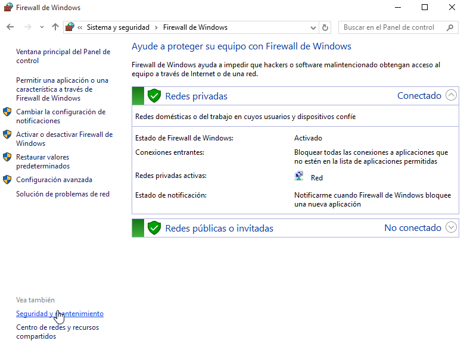
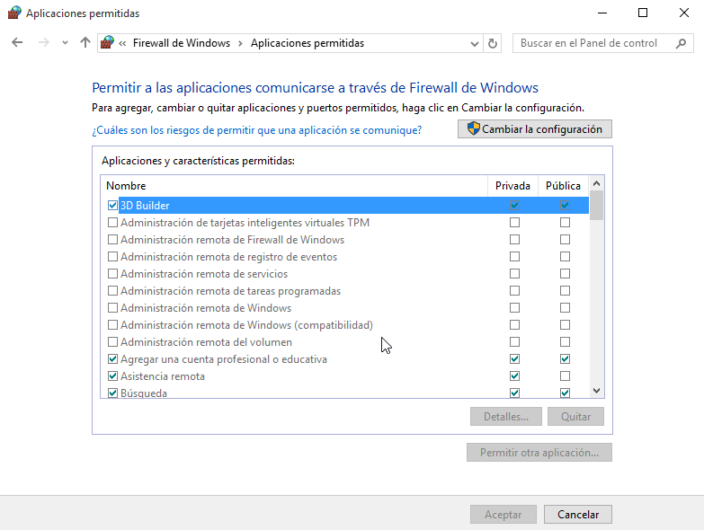

\newpage

# El cortafuegos (Firewall) en Windows

Un firewall es software o hardware que comprueba la información procedente de Internet o de una red y, a continuación, bloquea o permite el paso de ésta al equipo, en función de la configuración del firewall.
Un firewall puede ayudar a impedir que hackers o software malintencionado (como gusanos) obtengan acceso al equipo a través de una red o de Internet. Un firewall también puede ayudar a impedir que el equipo envíe software malintencionado a otros equipos.

En la siguiente ilustración se muestra el funcionamiento de un firewall.

Un firewall crea una barrera entre Internet y el equipo, igual que la barrera física que constituiría una pared de ladrillos.
Un firewall no es lo mismo que un programa antivirus. Para ayudar a proteger su equipo, necesitamos tanto un firewall como un programa antivirus y *antimalware*.

## Configuración de excepciones del Firewall de Windows

Para añadir una nueva aplicación o característica a nuestro Firewall debemos añadirlo de manera manual si no se ha añadido.  Para ello debemos pulsar sobre la 
opción de *Permitir una aplicación o una característica a través de Firewall de Windows*.  Se nos muestra el listado de todas las aplicaciones que están siendo 
controladas por parte del Firewall.

Pulsaremos en el botón de *Cambiar la configuración* y el listado pasará a ser editable. Ahora tenemos que añadir una nueva.

### Otros enlaces de interés

* [Why you don't need to install a third-party firewall](http://www.howtogeek.com/165203/why-you-dont-need-to-install-a-third-party-firewall-and-when-you-do/)

