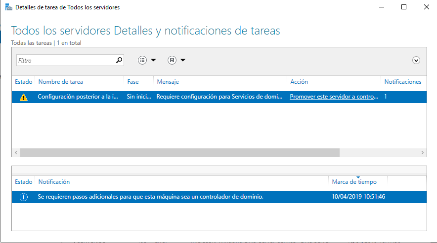
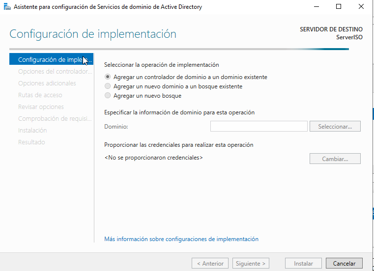
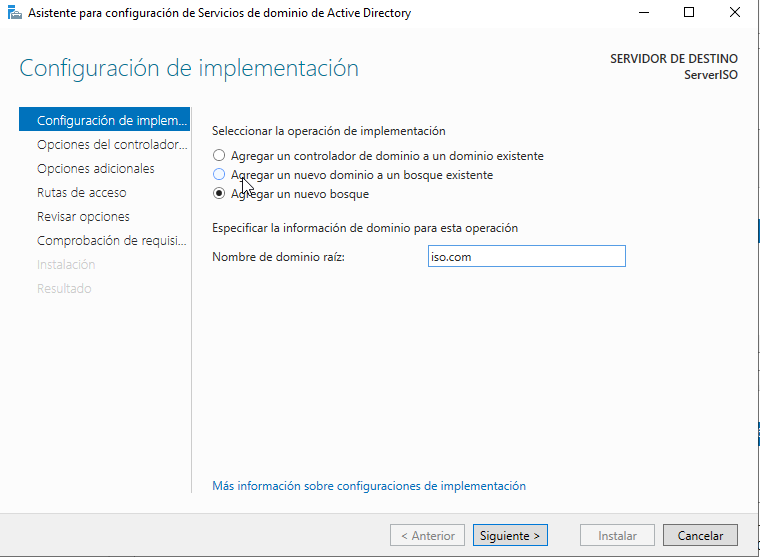
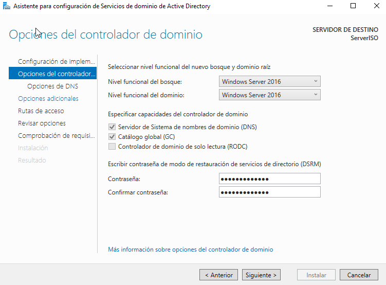
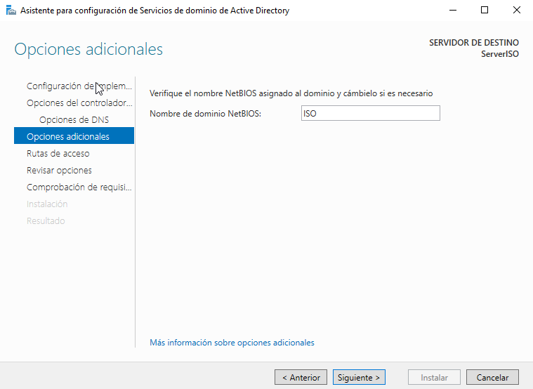
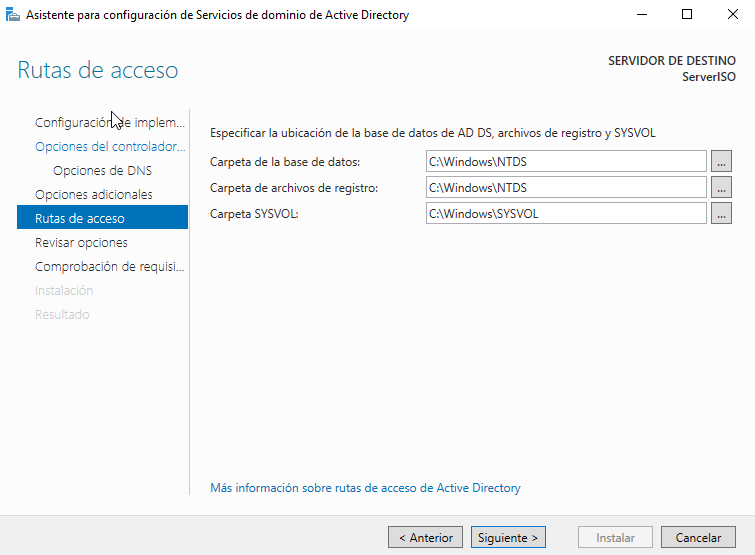
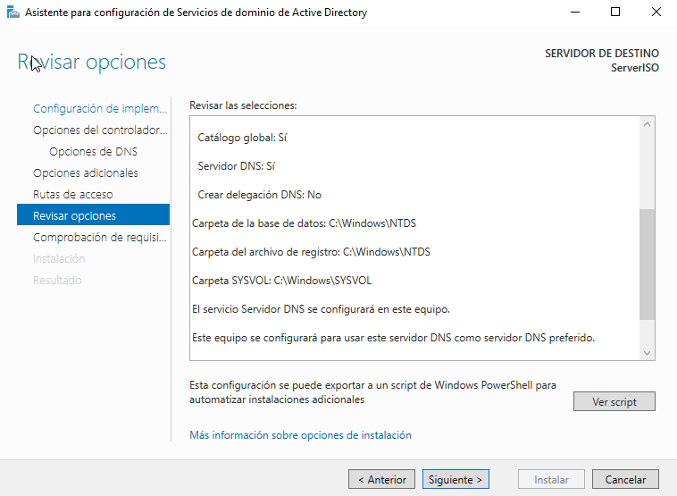
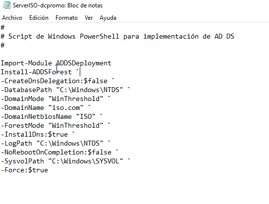
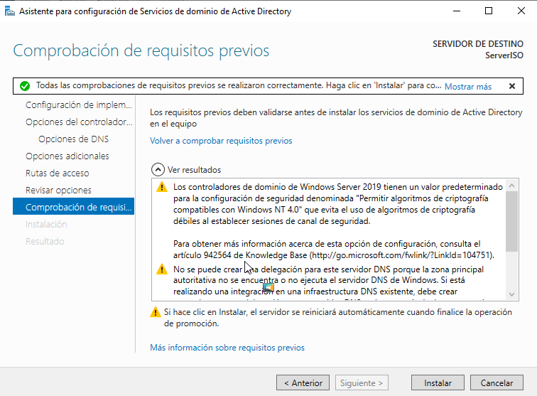
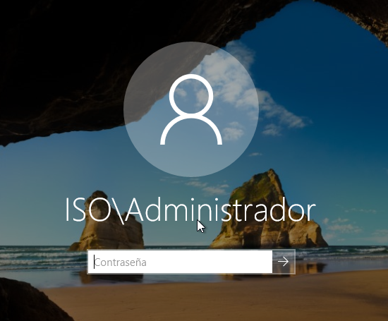

# Tarea: Creación de un dominio en Windows 2019

## Requisitos previos

Contaremos con la guía que vimos en la unidad anterior de instalación de Windows 2019 server, en el caso de que no tengamos instalado el servidor windows.

Los requisitos hardware son los mismos que vimos en la unidad anterior.

Hay que tener en cuenta que es muy importante que el equipo que vaya a ser el controlador de dominio cuente con una IP estática, ya que todos los otros ordenadores y recursos que utilizaremos en el dominio dependen de que el servidor siempre cuente con la misma IP.

## Cambio de nombre del equipo

Si es necesario cambiar el nombre del equipo a uno que sea fácil de recordar podremos hacerlo desde:

* El administrador del servidor -> _Servidor Local_
* Usando la opción _Sistema -> Configuración avanzada del sistema > Nombre de equipo_

Estableceremos como nombre `ServerISO`.

## Configuración de la red

Utilizando las herramientas que hemos visto en unidades anteriores estableceremos una IP dentro del rango de la Red NAT que hemos creado en el VirtualBox.

| Campo | Valor |
| ----- | ----- |
| IP|  10.0.2.42 |
| MASK | 255.255.255.0|
| Gateway | 10.0.2.1|
| DNS Server | 127.0.0.1 |
| DNS Server 2 | 1.1.1.1 |

## Configuración del Servidor de Dominio

Una vez configurados el Nombre y la dirección IP del servidor procedemos a instalar los roles respectivos de un controlador de Dominio

## Instalando el rol de Directorio Activo.

Desde el _Administrador del servidor_ seleccionamos la opción _Agregar roles y características_ donde veremos el siguiente asistente, que nos indica que debemos completar antes las tareas que aparecen.

Una vez verificado, seleccionaremos el tipo de Instalación: _Instalación basada en características o roles._

Seleccionamos nuestro servidor (el único).

Nos aseguraremos que tenemos seleccionados los siguientes servicios:

* Servicios de dominio de active directory
* DNS
* DHCP

Seguiremos el asistente y nos instalará todos los roles que hemos seleccionado.

*REINICIAR EL EQUIPO*

Una vez hemos instalado los servicios y hemos reiniciado el equipo, hay que configurarlo.

## Promoción a controlador de dominio

Hemos visto en teoria que los dominios son estructuras jerárquicas, que dependen todos los ordenadores de uno central.
Lo que debemos hacer en esta práctica es _promocionar_ el servidor que tenemos instalado  a _nodo principal_. La configuración
de un ordenador como controlador de un dominio o bosque se denomina comúnmente _promoción_.

Deberemos crear un _bosque_ (tal y como hemos visto en teoría) que sea nuestro nombre de dominio (iso.com)

Para ello, en la pestaña de AD DS vemos que ha aparecido un aviso indicándonos que es necesario que configuremos
algunos parámetros adicionales.

\

Seguiremos los pasos del asistente

\

\

En la siguiente pantalla deberemos definir los parámetros:

* Nivel funcional del bosque
* Nivel funcional del dominio
* Funciones del dominio (DNS,DHCP,etc)
* Contraseña del modo recuperación -> #netAdmin1s0#

\

Estableceremos el nombre en **NetBIOS**, un modo legado de compatibilidad

\

Configuraremos las diferentes rutas de acceso a las distintas bases de datos
del Directorio Activo.

\

En uno de los últimos pasos se muestra un resumen de la configuración que se va 
a aplicar, dándonos la opción de guardar la configuración en un
script de powershell, para futuros despliegues.

\

\

_Nos guardaremos el script para realizar ejercicios más adelante_.

Antes de realizar los cambios necesarios para la promoción de nuestro 
servidor a Controlador de Dominio (bosque), se realizan unas comprobaciones
para asegurarnos de que no existe incompatibilidad entre los distintios servicios 
que integran el Directorio Activo y otros que pudiéramos tener configurados.

\

El equipo se reiniciará cuando acabe el proceso.

\

Si todo ha ido bien, veremos que nuestro _login_ a cambiado, indicando ahora
cual es el dominio al que pertenecen los usuarios de la máquina.

\

## Tarea

Realizar estos pasos en vuestro servidor, documentando cada paso.
Entregar también el Script en PowerShell que se ha generado.
