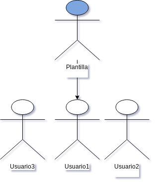
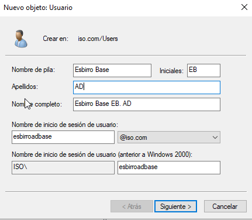
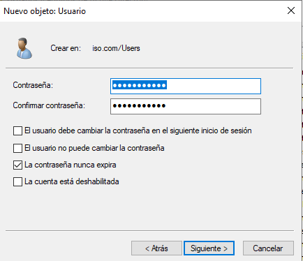
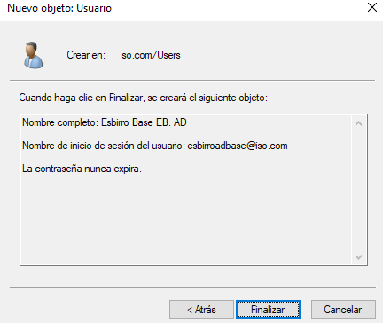
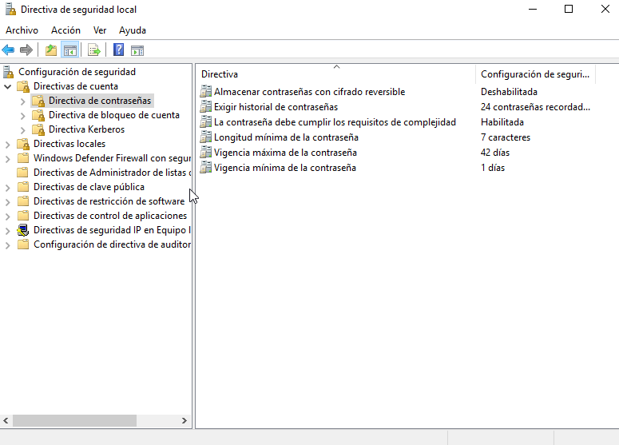
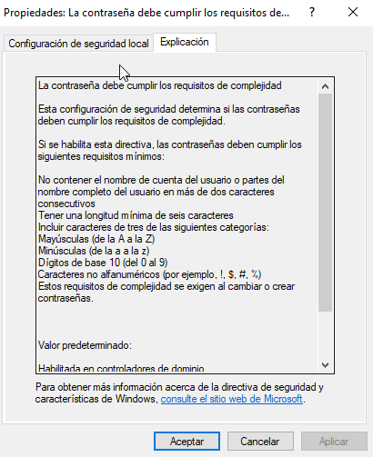
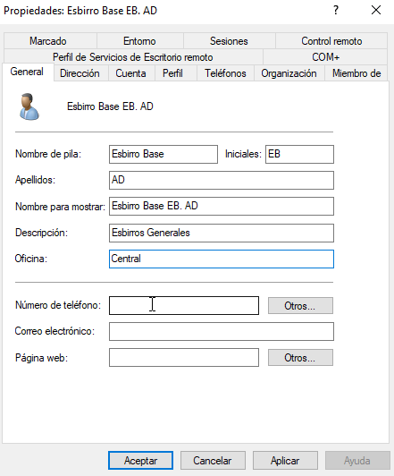
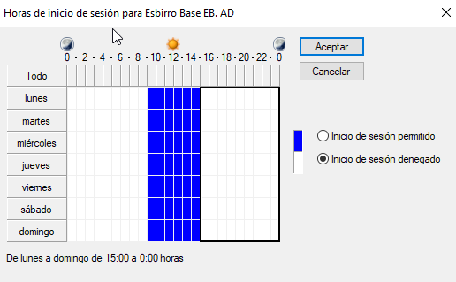

# Tarea: Creación de una plantilla de usuario en Windows 2019

Hemos visto en Unidades anteriores como gestionar los usuarios y los grupos en un sistema _local_, veremos ahora como crear una plantilla que podremos utilizar para añadir varios usuarios que contengan las mismas características.

Se ha hecho incapié a lo largo de todo el curso en que la automatización de los procesos reduce las posibilidades de fallo e incrementa la reproducibilidad de los posibles problemas que puedan surgir, es por ello que siempre es una buena idea dedicarle un poco de tiempo a la automatización y _generalización_ de los procesos que llevamos a cabo como administradores de sistemas.

La idea es crear un usuario que tendrá todas las características comunes que necesitemos y a continuación lo utilizaremos como plantilla para la creación de otros usuarios similares.

\ 

En el apartado de _Administración del servidor_, en _Herramientas_ ,seleccionamos la opción de _Usuarios y Grupos de Active Directory_.  

En la sección _Users_, crearemos el nuevo usuario.

Lo crearemos con los datos que se muestran en las imágenes.

\

\

Contraseña: **1q2w3e4r++**

\

Si intentamos poner una contraseña más sencilla o que incluya el nombre del usuario, la política
de seguridad del Active Directory nos lo impide.

Para poder ver las políticas de contraseñas podemos ir a:

_Administración del Servidor -> AD DS -> Herramientas -> Directivas de seguridad Local_

Y allí en el apartado _Directivas de Cuenta -> Directivas de contraseñas_ podemos ver las que están 
activas para el dominio.

\

\

Volveremos a la gestión de usuarios y  modificaremos algunos parámetros del usuario, de tal manera que cuando lo utilicemos como plantilla, estemos copiando esas características adicionales.

Estableceremos las siguientes características:

* En la descripción pondremos : "Esbirros generales".
* En la oficina pondremos: "Central".
* La contraseña _nunca_ expira.
* El usuario solo puede iniciar sesión desde las 9:00 hasta las 14:00.

\

\

Una vez aplicada esta configuración, pasaremos a copiar el usuario (via botón derecho), creando un usuario nuevo (esbirroad02) y comprobaremos que el usuario ha adquirido las características especiales que habíamos establecido en el usuario plantilla.

# Ejercicio

Documenta todo el proceso seguido, haciendo especial hincapié en las características especiales que hemos asignado al usuario. ¿Porqué crees que vale la pena utilizar este tipo de soluciones en vez de crear los usuarios de uno en uno?.
