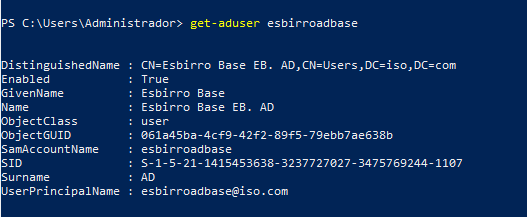

# Tarea: Clonando usuarios con PowerShell

Vamos ahora a utilizar PowerShell para crear varios usuarios a partir de una plantilla generada previamente.

Para ello lo que haremos será guardarnos en una variable el usuario _plantilla_ y luego generar copias de ese usuario con otros nombres. 


```PowerShell
Get-ADUser esbirroadbase
```

Nos mostrará algo similar a esto:


\ 

Pero para crearlos de manera correcta necesitamos copiar todas las propiedades 
de los usuarios. Para ello utilizaremos el parámetro `-Properties *`.

```PowerShell
Get-ADUser esbirroadbase -Properties *
```

Esto nos mostrará por salida estándar todas las propiedades de nuestro usuario plantilla, si todo esta correcto, pasaremos a guardarlo en una variable:

```PowerShell
$base = Get-ADUser esbirroadbase -Properties *
```

Una vez tenemos el usuario en esa variable `$base` ya podemos utilizarlo para la creación de tantos usuarios como queramos:

```PowerShell
New-ADUser -Name 'esbirroad10' -Instance $base
```

## Ejercicio

Escribe un Script que pregunte al usuario cual es el nombre de un usuario y lo cree utilizando como plantilla el usuario _esbirroadbase_ que hemos generado anteriormente.

## Ejercicio

Escribe un Script que pida un número entre el 5 y el 10 y genere ese número de usuarios utilizando como base el usuario _esbirroadbase_.
