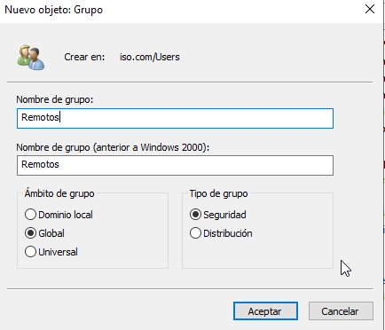
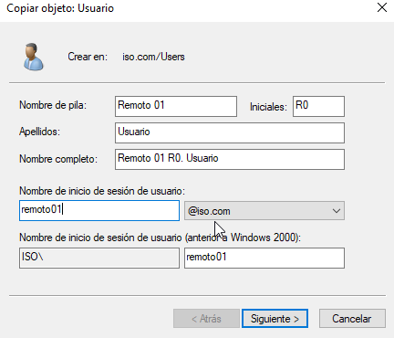
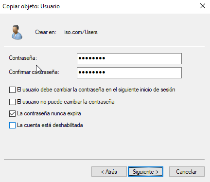
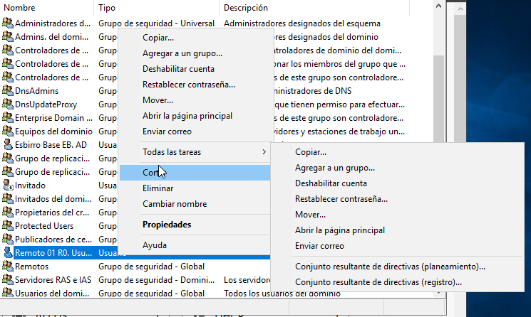
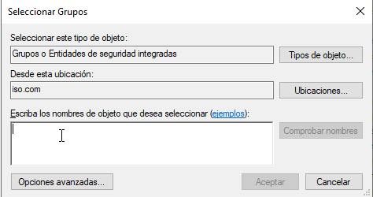
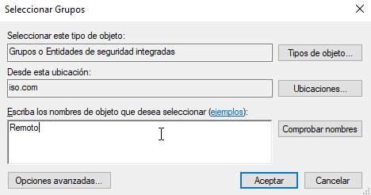
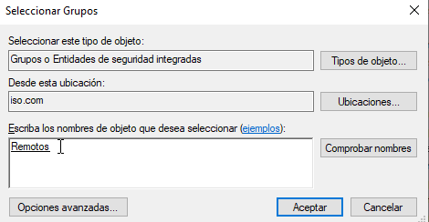
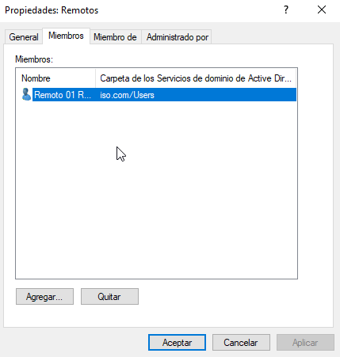

# Tarea: Creación de un Grupo de Seguridad

En esta práctica crearemos un Grupo de Seguridad y añadiremos un usuario a ese grupo.

Este grupo lo utilizaremos más adelante para asignarle Políticas de grupo y asignarle permisos.

Para la creación de este grupo, iremos a la ventana de _Usuarios y Grupos de Active Directory_ y bajo el dominio _iso.com_ crearemos un _Nuevo -> Grupo_.

Rellenaremos los campos tal y como aparece en la imágen.


\

A continuación copiaremos el usuario que hicimos como plantilla y generaremos un usuario que se llamará : **remoto01**.


\

Pondremos la contraseña habitual:

**Admin1s0**


\

Y Lo agregaremos al grupo que acabamos de crear.


\

En esta ventana aparecerá un pequeño asistente que veremos muchas veces a lo largo del curso, y que además es muy importante saber manejarlo de manera adecuada.


\

En el primer campo, nos permite seleccionar el tipo de Objeto que estamos creando o modificando.

En el segundo, en que dominio o subdominio esta siendo creado el objeto. En nuestro caso aparece _iso.com_.

El tercer campo, que permite introducir texto, nos permite escribir los grupos, usuarios, y demás objetos del dominio que estamos seleccionando. Es importante, aunque estemos _totalmente seguros_ de que hemos escrito bien los grupos o usuarios, que pulsemos el botón "Comprobar nombres", ya que este realiza una búsqueda en el dominio y nos indicará **subrayando** el nombre de los objetos, aquellos que **han sido encontrados**.

En caso de que no hayamos escrito bien el nombre, o el patrón de búsqueda no haya sido lo suficientemente preciso, aparecerá un pequeño asistente que nos permitirá seleccionar de manera más exacta los objetos que deseamos.


\

Al pulsar en "Comprobar nombres", cambia a lo siguiente:


\

Pulsaremos en finalizar y comprobaremos en las propiedades del grupo que entre sus miembros contamos con el usuario remoto01: _


\

## Ejercicio 1 

Crea 9 usuarios a partir de `remoto01` y añadelos al grupo `Remotos`.

Los uids de los los usuarios han de ser :

`remoto02`
`remoto03`
....
`remoto10`

Documenta los pasos seguidos.

## Ejercicio 2

Crea un *Script* en PowerShell que liste los usuarios del Grupo `Remotos`.

## Ejercicio 3

Describe _brevemente_ qué función realiza el siguiente Script:

```PowerShell

Import-Module ActiveDirectory
Get-AdGroupMember -identity 'Remotos' | Select name

```
