# Tarea: Instalación de OpenLDAP

Vamos a realizar ahora la instalación y posterior configuración del servicio de OpenLDAP. El objetivo es preparar una máquina con GNU/LinuX para que funcione como
servidor de LDAP en el que almacenaremos los usuarios y los grupos a los que asignaremos más adelante diferentes permisos y configuraciones sobre recursos de nuestra red.

Existen muchos servidores OpenSource de LDAP, pero uno de los más famosos es OpenLDAP, que será el que instalaremos y configuraremos en esta práctica.

## Instalación del servicio

En la máquina Xubuntu que tenemos, instalaremos el paquete `slapd` que contiene el _demonio_ o servidor de ldap.

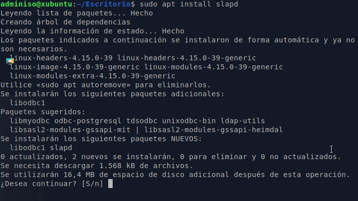
\

La orden que ejecutaremos es :

```shell
sudo apt install slapd
```

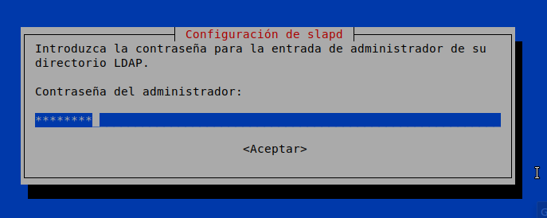
\

Durante la instalación nos preguntará por la contraseña del administrador del LDAP (no tiene por qué ser la misma que la del administrador _local_ de la máquina, pero en esta práctica _sí_ que usaremos el mismo: **admin1s0**)

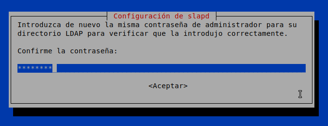
\

OpenLDAP no tiene una configuración especialmente amigable para el usuario, así que lo que haremos será instalar un pequeño gestor Web que nos permite via navegador administrar el LDAP si conocemos la IP (O el nombre) de nuestro servidor. 

Este tipo de herramientas son especialmente útiles en entornos empresariales, ya que nos permite administrar de manera remota cualquier servicio, utilizando herramientas gráficas, sin necesidad de instalar un servidor de X en las máquinas que contienen dichos servicios.

Buscaremos en los repositorios una herramienta que nos permita administrar el LDAP.

```shell
sudo apt search ldapadmin
```

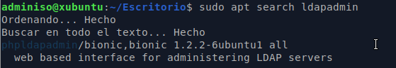
\

Entre los resultados seleccionaremos el paquete `phpldapadmin` que entre sus dependencias cuenta con un servidor web (el _apache_) con el que podremos conectarnos a nuestro LDAP _local_ desde cualquier máquina de la red que esté accesible y administrar el servicio.

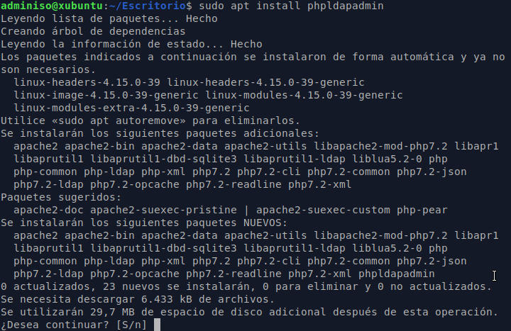
\

## Accediendo a phpLDAPadmin

Una vez lo tengamos instalado, abriremos el navegador e introduciremos en la barra de direcciones la _ip_ o nombre del servidor de LDAP + `phpldapadmin`.

Tal y como se vé en el ejemplo:

`http://localhost/phpldapadmin/`

Aparecen una serie de errores (más bien avisos) que nos indican que algunas de las funciones que está utilizando el programa está **obsoletas** (_deprecated_).

Son avisos que no afectan a la funcionalidad del programa, sin embargo si queremos solucionarlos, podemos seguir los pasos que se adjuntan en la otra práctica de la unidad :

**Parcheando phpLDAPadmin**

En las siguientes capturas, no aparecerán los errores, asumiendo que se ha _arreglado_ el servicio siguiendo los pasos descritos.


\

Ahora deberemos reconfigurar el servidor de ldap (`slapd`) para introducir los valores que necesitamos para adecuarlo a nuestra infraestructura.

## Reconfigurando slapd

Para realizar la re-configuración de slapd, ejecutaremos desde el terminalel comando:

```shell
sudo dpkg-reconfigure slapd
```

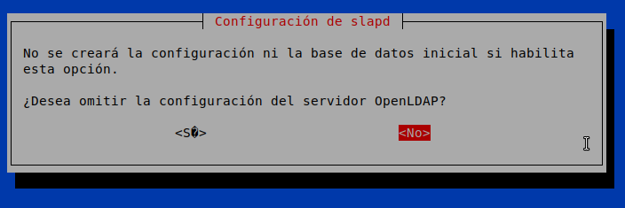
\

Marcaremos la opción de _No omitir_ la configuración del servidor, de esta manera podremos responder a todas las preguntas que necesitamos.

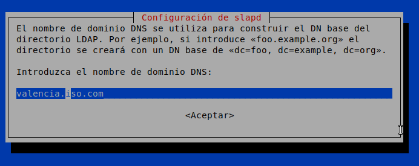
\

En este punto nos preguntará por el nombre del dominio que usaremos para crear el DN base del directorio (_Distinguisehd Name_), en nuestro caso seleccionaremos la sede de _Valencia_ de nuestra empresa:

`valencia.iso.com`

que equivaldría a un DN base de: <dc=valencia,dc=iso,dc=com>.

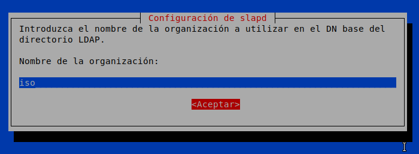
\

Estableceremos también el nombre de la organización:

`iso`

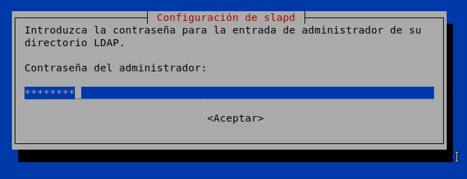
\

así como la contraseña del administrador (_puede ser la misma_).

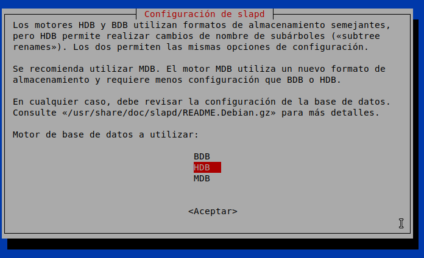
\

En el apartado del motor de base de datos, seleccionaremos el motor `HDB`.


\

En esta pregunta nos indica qué debe hacer el gestor de software si decidimos borrar el paquete, lo que marcaremos será **NO Borrar** la base de datos en caso de desinstalación del servicio `slapd` para posibles recuperaciones frente a desastres. 

Esto nos marca también que si queremos borrar la base de datos tendremos que realizar esta operación manualmente, y no nos servirá el proceso de _desinstalación_ del servidor de LDAP.

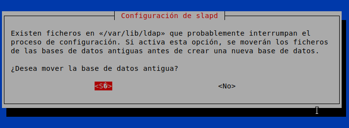
\

Por último, nos pregunta si deseamos mover la base de datos antigua (que está vacia en este momento) durante este proceso. Optaremos por la opción: **Sí**

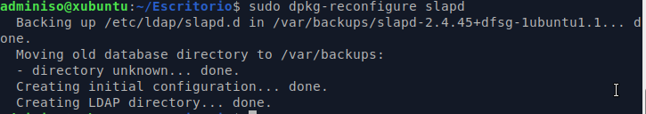
\

## Configurando phpLDAPadmin

Una vez realizado todo el proceso anterior, si volvemos a la pantalla de phpLDAPadmin, veremos que utilizando un **dn** de administrador nos permite entrar en el servidor.

`cn=admin,dc=valencia,dc=iso,dc=com`

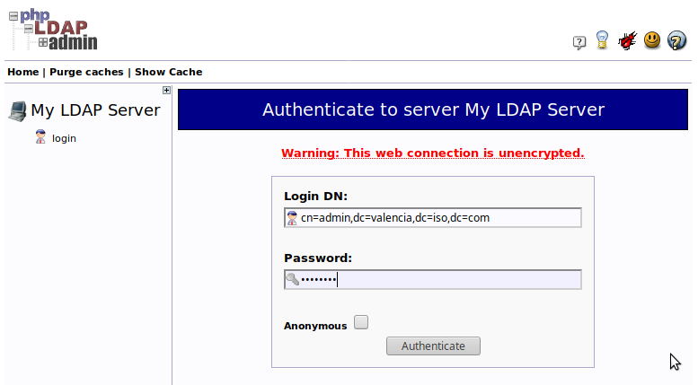
\

Sin embargo, aunque la autenticación ha tenido éxito, no podemos administrar nuestro dominio, ya que nos aparece en la parte derecha para administrar el dominio: 

`example.com`

que _No funciona_.

Esto es debido a que _por defecto_ el phpLDAPadmin administra ese dominio. Deberemos ir al fichero de configuración y cambiar la _base_ de la búsqueda.

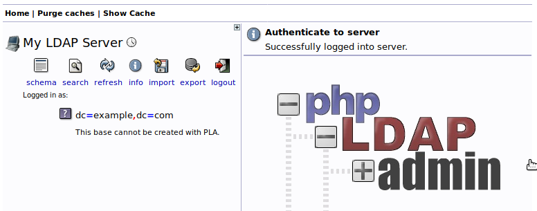
\

El fichero de configuración se encuentra en :

`/etc/phpldapadmin/config.php`

Debemos buscar la línea siguiente, y cambiar los servers a los que queremos administrar.

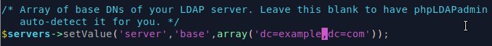
\

Ejemplo:

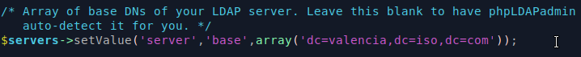
\

Ahora al conectarnos de nuevo en el phpLDAPadmin veremos una estructura como esta:

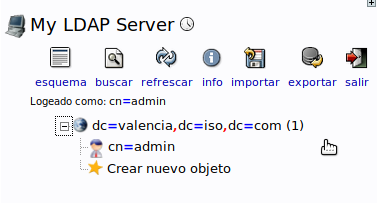
\

## Creando nuestros objetos en LDAP

Ahora ya tenemos las herramientas preparadas para ser utilizadas para crear y administrar nuestro servidor LDAP.

En esta práctica crearemos una **OU** que llamaremos `esbirros`, en su interior quedará un grupo _POSIX_ que llamaremos `esbirrosldap`. Dentro de ese grupo crearemos los diferentes usuarios más adelante.

La estructura quedará de esta manera:

```
dc=valencia,dc=iso,dc=com
    ou=esbirros
        cn=esbirrosldap
            uid=esbirroldap01
```

Crearemos primero la **OU** (Organizational Unit).

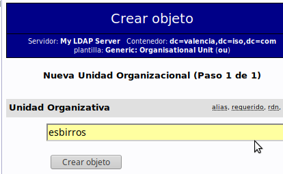
\

Introduciremos los datos correspondientes y crearemos la entrada en el árbol.


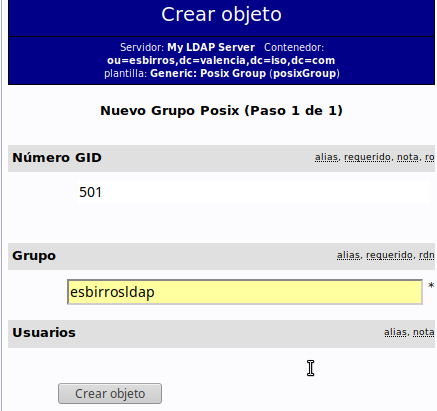
\

Ahora crearemos el grupo dentro de la **OU**

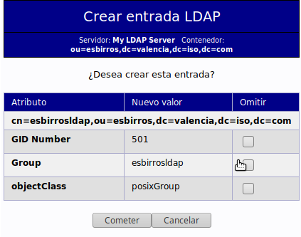
\

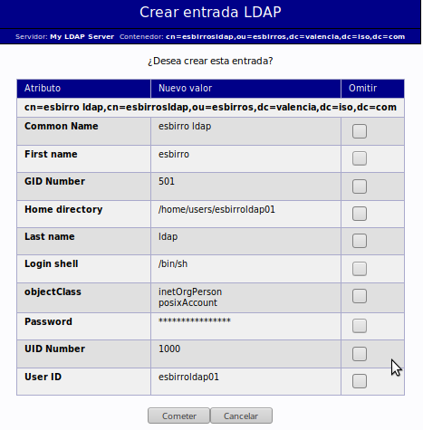
\

Y por último crearemos el usuario `esbirroldap01`, con los valores que se muestran en la imágen.


La estructura quedará así:

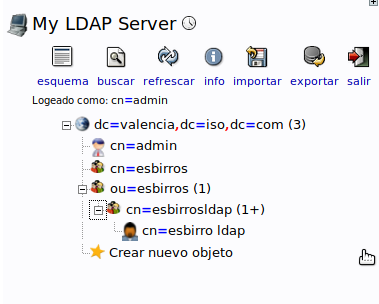
\

## Instalación de las ldap-utils

Para poder acceder a los datos contenidos en el LDAP desde la terminal, podemos instalar una serie de utilidades nos permitirán realizar consultas y modificaciones.

`sudo apt install ldap-utils`

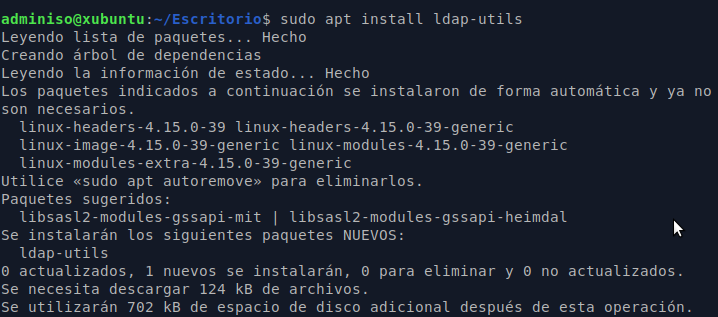
\

Una vez realizada la instalación, podemos comprobar que somos capaces de contactar con el `ldap` utilizando la línea de comandos:

`ldapsearch -x -h localhost -p 389 -b "dc=valencia,dc=iso,dc=com"`

que nos debería devolver una salida similar a esta:

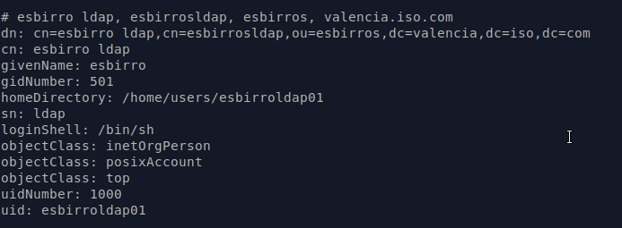
\

## Ejercicio 1

Realiza los pasos descritos en la práctica, documentando _brevemente_ cada uno de ellos y adjunta una captura de la ejecución del comando `ldapsearch -x -h localhost -p 389 -b "dc=valencia,dc=iso,dc=com"`
