# Tarea: Unión al Dominio con Windows

En esta tarea veremos como unir una máquina con Windows 10  al dominio que hemos creado en las unidades anteriores.

## Requisitos de Infraestructura

Una vez tengamos el Servidor de Active Directory en Marcha (_server2019_), y en nuestra red NAT, tal y como configuramos en la unidad anterior, conectaremos la MV con Windows 10 a la red NAT, y realizaremos los pasos siguientes.

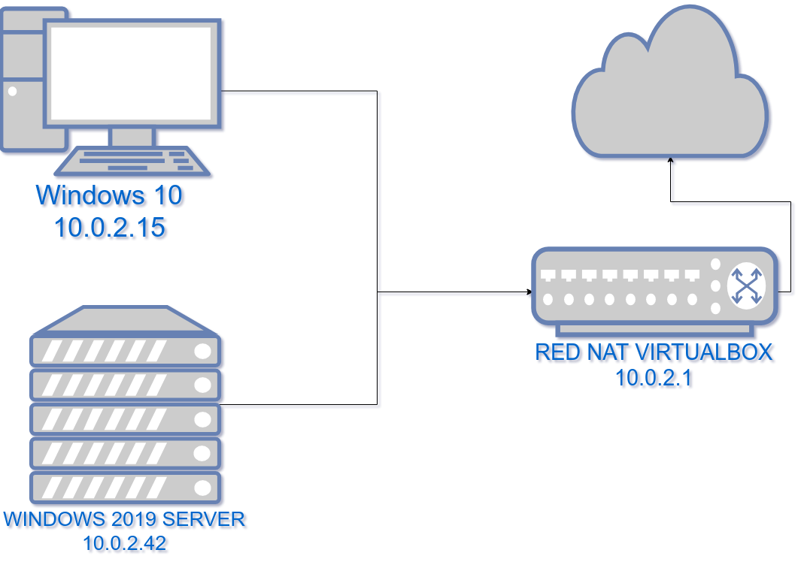
\ 

## Paso 1: DNS e IPs

Lo primero es que nuestra máquina cliente (Windows) sea capaz de encontrar el servidor de Active Directory tanto por nombre como por IP.

Para ello iremos a la configuración de la red y estableceremos la IP del servidor 2019 como DNS principal. 

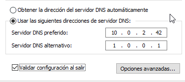

## Paso 2: Union al Dominio

Una vez tenemos el DNS configurado y nos hemos asegurado que podemos conectar con el servidor de nuestro dominio desde el cliente, lanzaremos el asistente de unión al dominio. 

Para ello, iremos a `Sistema` -> Y en la Configuración de nombre, grupo de trabajo y dominio, pulsaremos en `Cambiar Configuración`.

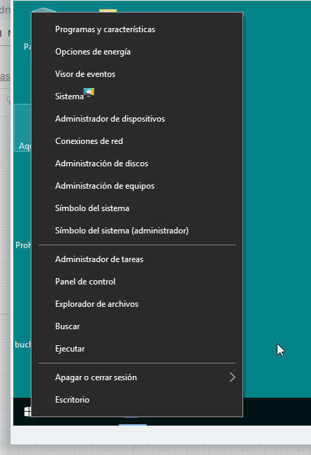
\

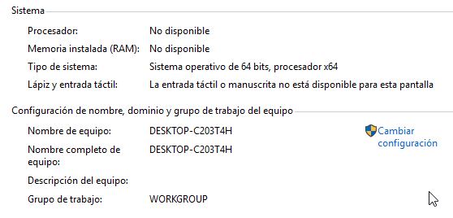
\

El asistente se encuentra en el botón `Id. de red...`.

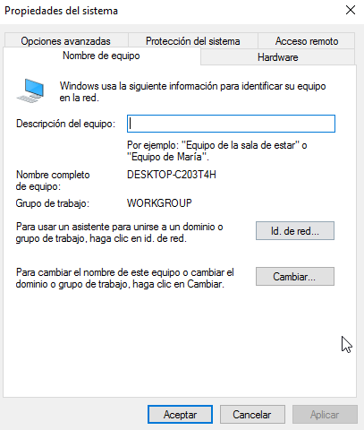
\

Ahora seguiremos los pasos, contestando a las preguntas tal y como se muestra en las imágenes.

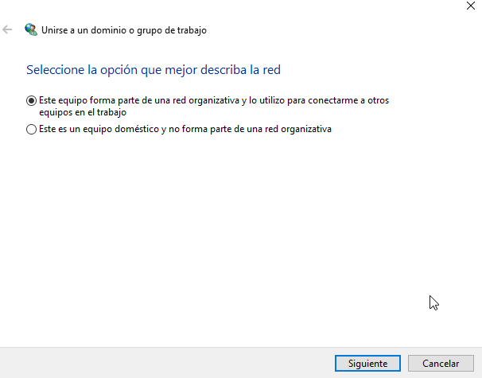
\

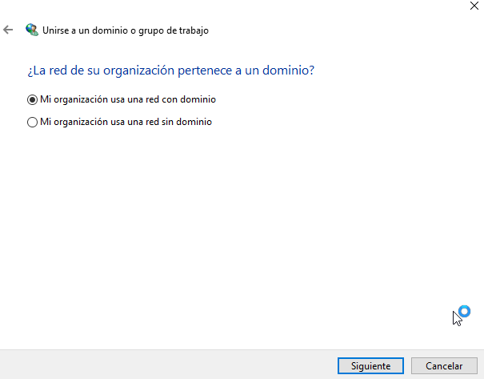
\

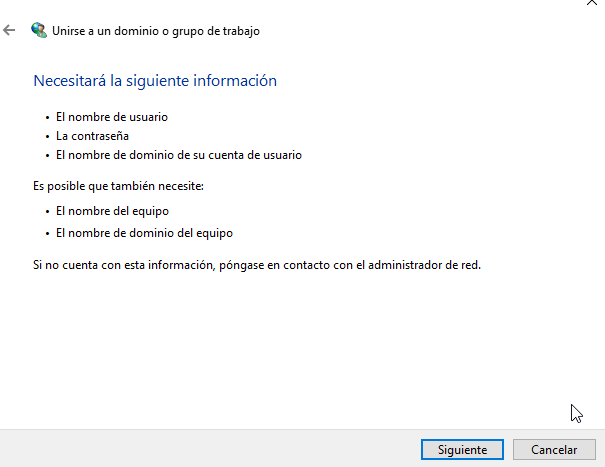
\

En este paso se nos pregunta por un usurio que tenga permisos para unir máquinas al dominio, en nuestro caso el `Administrador`. 

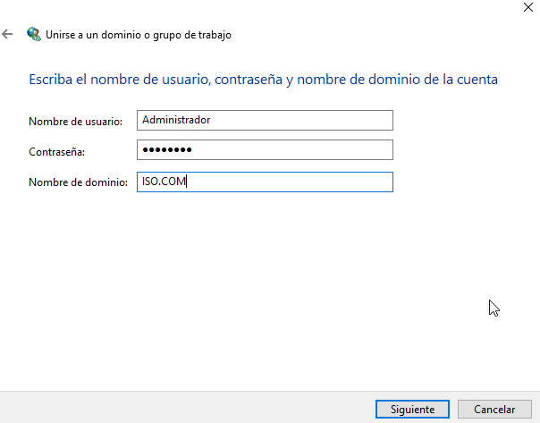
\

Debemos indicar cuál será el nombre de la máquina en el dominio, para identificarla fácilmente estableceremos DESKTOP-W10, pero podría ser:

* DespachoDirección
* Fotocopias
* CopiasDeSeguridad
* ...

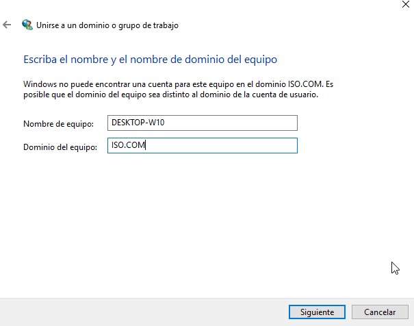
\

Ahora nos pregunta de nuevo por el usuario y la contraseña del dominio.

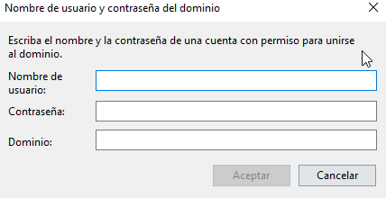
\

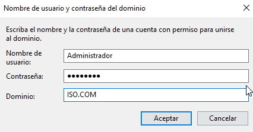
\

Una vez unido al dominio, debemos reiniciar y el asistente nos lo indica.

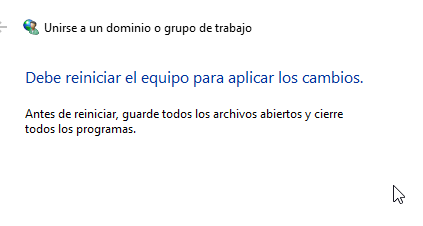
\

Al reiniciar, Windows 10 realiza los cambios necesarios para permitir el login de los usuarios del dominio en la máquina que acabamos de iniciar.

\

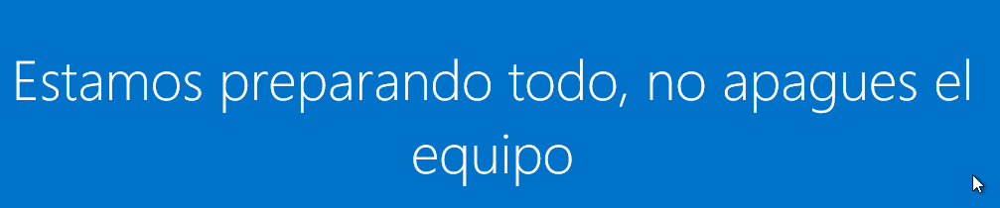
\

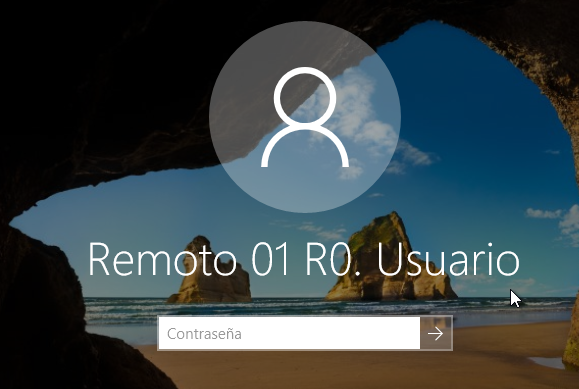
\

# Ejercicio 1

Realiza los pasos descritos anteriormente y documenta el proceso, detallando las diferencias (si las hubiera) en la conectividad y los diferentes nombres de usuarios y dominios.

Si durante el proceso ocurre alguna incidencia, describela y documenta cómo la has resuelto para poder continuar el proceso con éxito.

# Ejercicio 2

**Creación de un usuario nuevo**

Crea un usuario en el Servidor 2019 (en el Active Directory) y comprueba que puedes iniciar sesión en el Windows 10 nada más crearlo.

