# Tarea: Creación de GPO

En esta práctica crearemos una Política de Grupo, que nos permitirá realizar una serie de acciones, configuraciones sobre las máquinas y los usuarios que son comunes en el dominio.

Se pueden definir muchísimas GPO sobre un dominio, aplicando sobre grupos, modelos de equipo, usuarios, etc.

Las posibilidades son muy grandes, y no podemos verlas todas, en esta práctica veremos tan solo una muestra y se planteará la realización de otras GPO al final de esta tarea.

## GPMS

En el menú de Administración del Servidor, en el apartado de _Administración de directivas de grupo_ o utilizando el comando: `gpmc`, aparece el dominio que hemos creado. Si expandemos el árbol hasta el dominio y pulsamos _botón derecho_ nos aparece un menú para la creación de las políticas de grupo (de ahora en adelante, GPO).

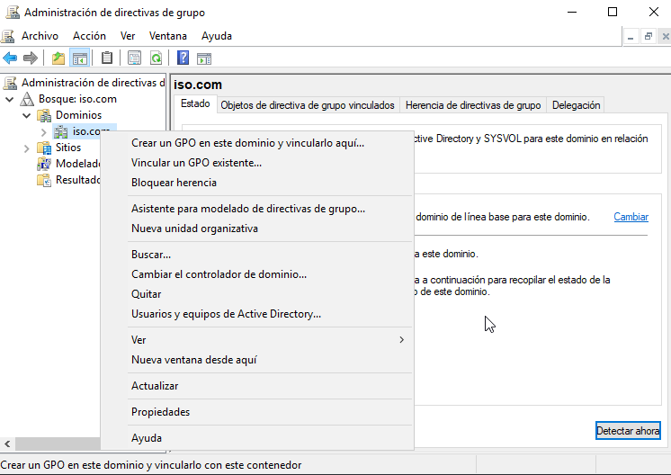
\

Llamaremos a la GPO `RemotosSeguridad` y no haremos que herede de ninguna anterior.

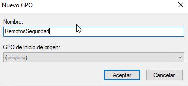
\

## Política 1: No guardar historial de documentos


Ahora nos permite indicar sobre qué debe aplicar la GPO, puede ser tantos sobre los equipos, como sobre los usuarios.

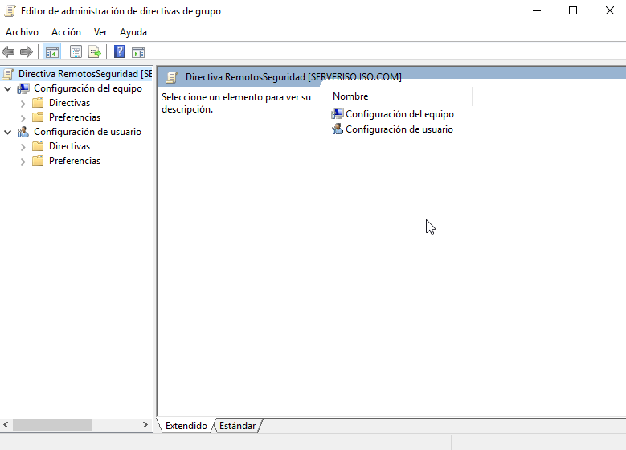
\

En este caso navegaremos el subárbol de _Configuración del equipo_ y seleccionaremos :

```
Configuración del equipo
    Directivas
        Plantillas administrativas
            Menú inicio y barra de tareas
                No guardar historial de documentos abiertos recientemente
```

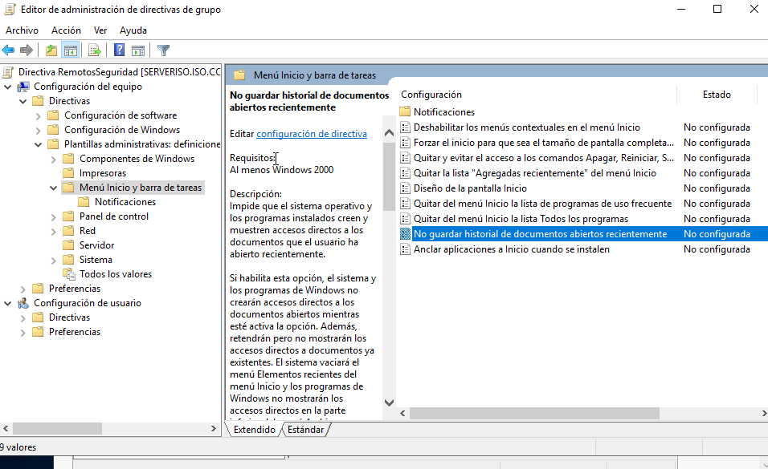
\

Lo marcaremos como `Habilitada`.

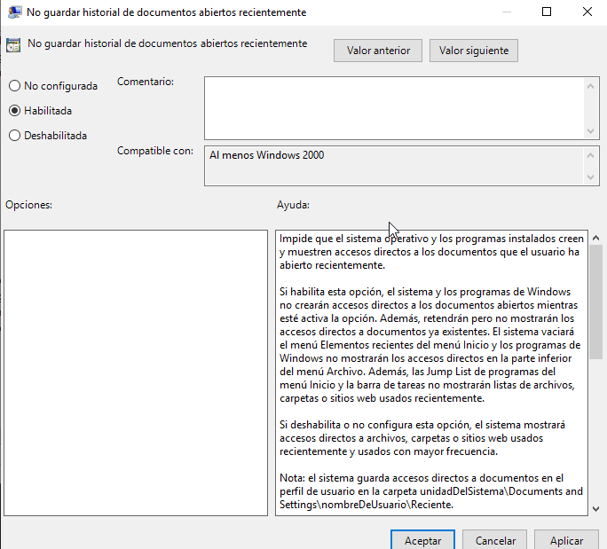
\

## Política 2: PowerShell

Ahora configuraremos PowerShell para permitir la ejecución de Scripts en el dominio. Esto lo haciamos antes manualmente ejecutando en PowerShell la orden:

```PowerShell
Set-ExecutionPolicy Unrestricted
```

Lo que haremos mediante esta política es que se aplique esta configuración de manera automática.

Para ello navegaremos el árbol hasta:

```
Configuración del equipo
    Directivas
        Plantillas administrativas
            Componentes de Windows
                Windows PowerShell
                    Activar la ejecución de scripts
```

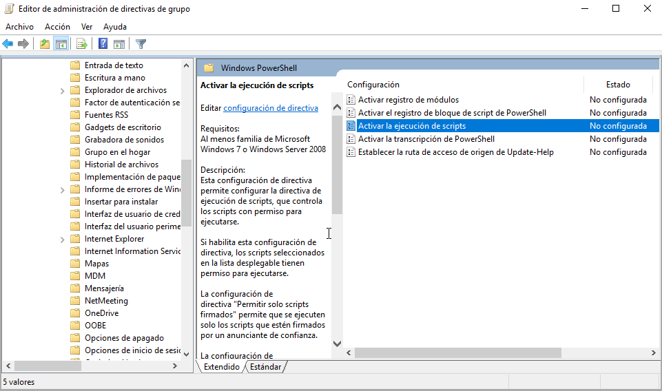
\

La habilitaremos y en la Directiva de ejecución seleccionaremos:

`Permitir todos los scripts`

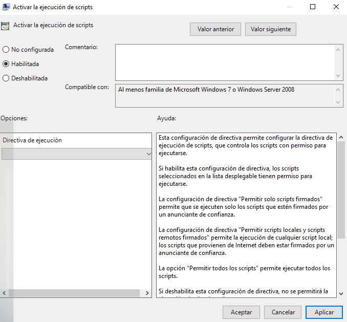
\

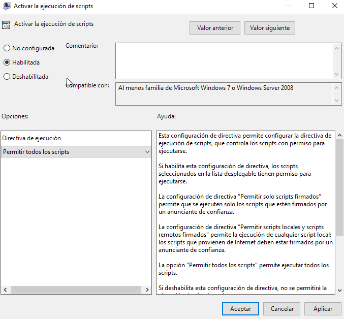
\

## Política 3: Instalación de Software

En esta política utilizaremos una carpeta compartida mediante SMB en el servidor para que nos sirva de repositorio de Software y nos permita instalar de manera automática software empaquetado mediante `.msi`, tal y como vimos en las unidades anteriores.

### 3.1 Compartir carpeta en Red

Tal y como vimos en Unidades anteriores, debemos hacer accesible a los equipos de la red una determinada carpeta que contendrá información relevante para nuestro dominio. En este caso lo que configuraremos es una carpeta que contendrá los diferentes instaladores de las aplicaciones que podemos necesitar y debe estar accesible para todos los usuarios del dominio. (En acceso de _lectura_).

Crearemos una carpeta en `C:\srv\software\` que tendrá los archivos de la instalación y la compartiremos.

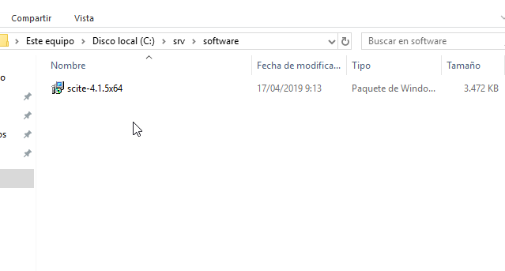
\

A través de las `Propiedades` de la carpeta `srv`, en `Compartir`. Seleccionaremos los grupos de usuarios que tendrán acceso a la carpeta.

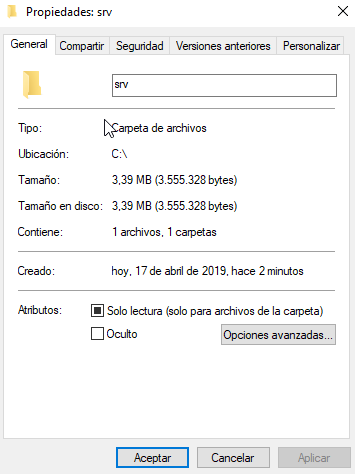
\

Añadiremos al grupo "Remotos" con `Lectura`.

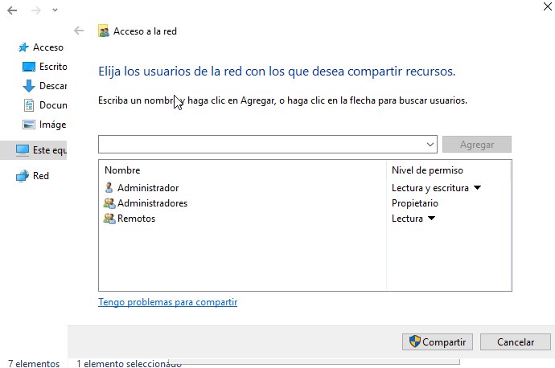
\

Cuando finalicemos el asistente, comprobaremos a través del Explorador de la Red que podemos acceder a la carpeta y copiaremos la ruta de la carpeta compartida a través de la red:

`\\SERVERISO\srv`

NO USAR LA RUTA LOCAL

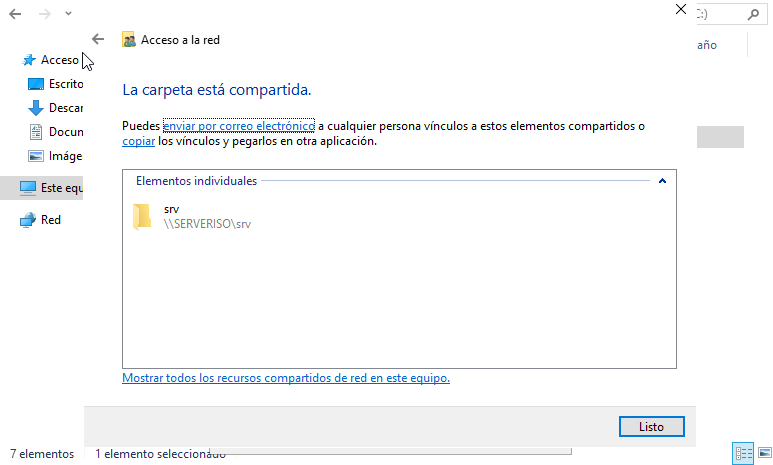
\

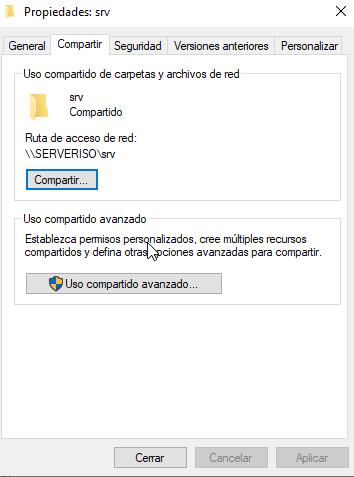
\

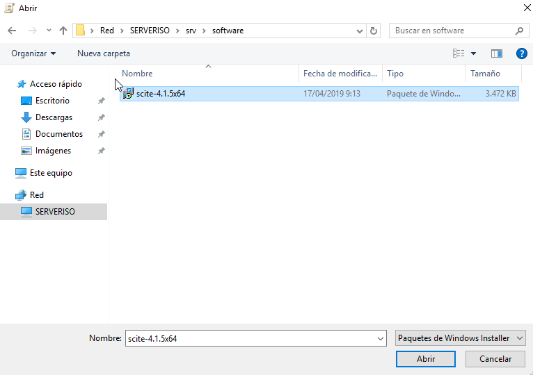
\

Una vez tengamos la carpeta compartida y nos hayamos asegurado de que se puede acceder desde la red, crearemos la GPO para que instale el software.

### 3.2 Crear la GPO de Software

Ahora navegaremos el árbol hasta Instalación de Software:

```
Configuración del equipo
    Directivas
        Configuración de Software
            Instalación de Software
```

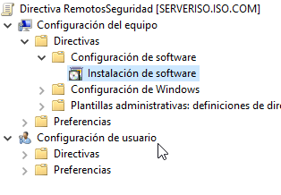
\

Deberemos marcar la opción: _Asignada_.

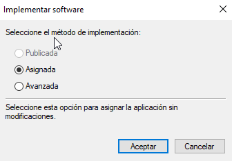
\

Pegaremos la ruta al `.msi` del SciTE y comprobaremos que en _Origen_ aparece la ruta de la red.

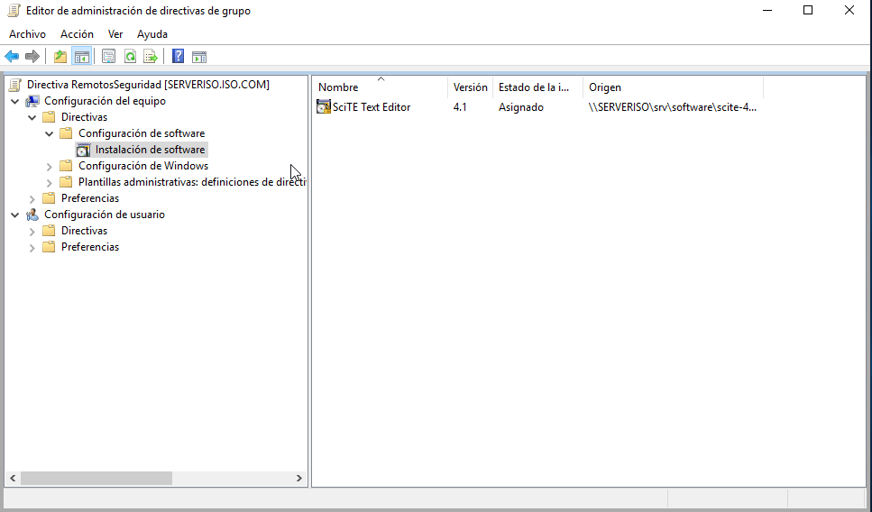
\

## Seleccionado usuarios

Por último en la ventana de Administración de Directivas de grupo, añadiremos al Grupo `Remotos` al filtrado de seguridad.

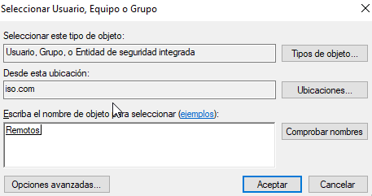
\

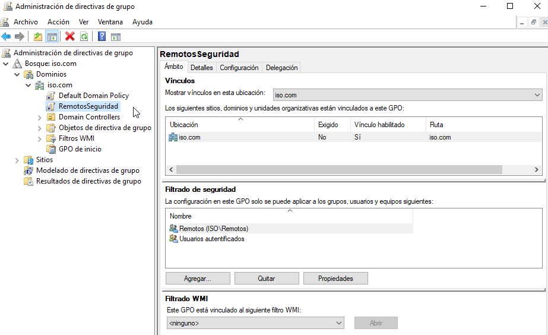
\

## Verificación de la GPO

Ahora, al iniciar sesión el dominio, se instalará de manera automática el SciTE y se aplicarán las dos configuraciones que  hemos establecido:

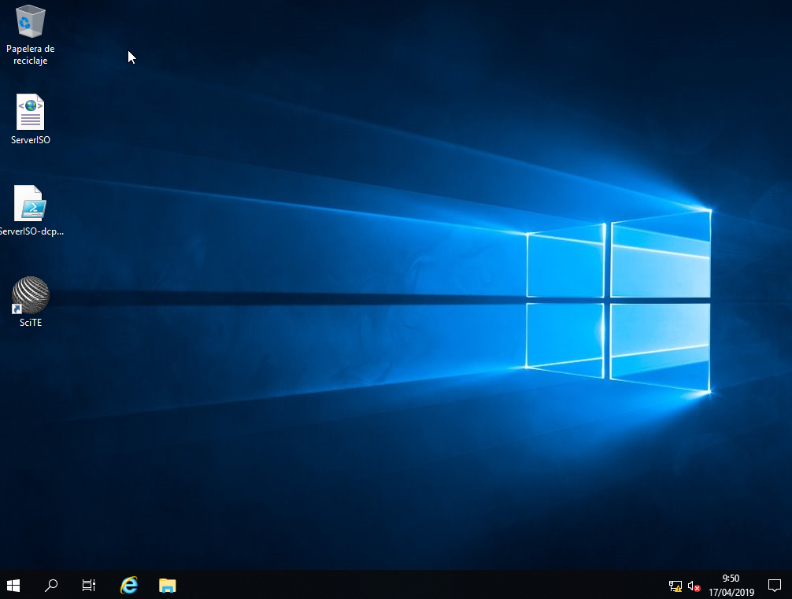
\

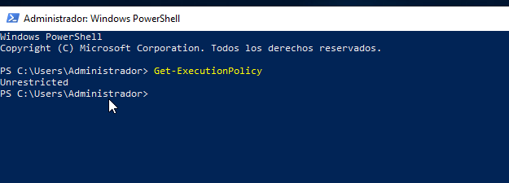
\

## Ejercicio 1 

Realiza todos los pasos descritos en la práctica y documenta los que consideres más importantes.

## Ejercicio 2

Genera otra GPO que aplique a los usuarios del dominio, que incluya:

- Configuración del Panel
- Configuración del Fondo de Pantalla

Documenta el proceso seguido

## Ejercicio 3

Genera otra GPO que instale software pero desde una de las carpetas compartidas desde el OpenMediaVault.

