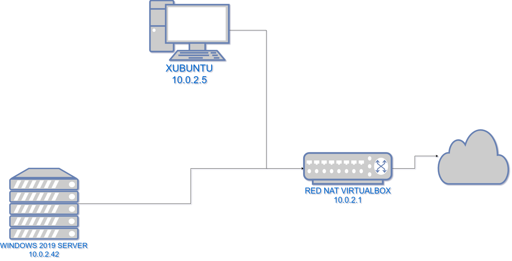
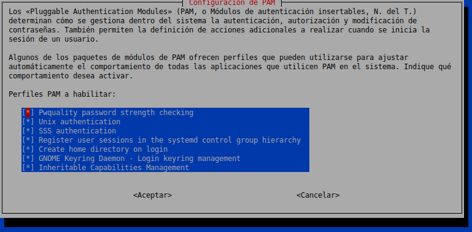
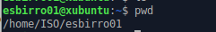
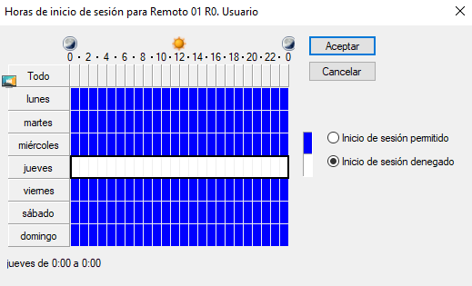

# Tarea: Unión al Dominio con Ubuntu

En esta tarea veremos como unir una máquina con Ubuntu (18.04) al dominio que hemos creado en las unidades anteriores.

## Requisitos de Infraestructura

Una vez tengamos el Servidor de Active Directory en Marcha (_server2019_), y en nuestra red NAT, tal y como configuramos en la unidad anterior, conectaremos una máquina con Ubuntu a la red NAT, y realizaremos los pasos siguientes.


\ 

## Paso 1: Hosts

Lo primero es que nuestra máquina cliente (Ubuntu) sea capaz de encontrar el servidor de Active Directory tanto por nombre como por IP.

Para ello añadiremos la IP del server al fichero : 

`/etc/hosts`

```shell
127.0.0.1       localhost
127.0.1.1       xubuntu
10.0.2.42       server2019.iso.com server2019

# ....
```

## Paso 2: Resolver (DNS)

Deberemos añadir el servidor de nombres de nuestro dominio como servidor de nombres del sistema cliente adicional. 

Para realizar esta tarea utilizaremos `systemd-resolver`. En el fichero:

```shell
/etc/systemd/resolved.conf
```

Estableceremos los siguientes valores:

```shell
#  This file is part of systemd.
#
#  systemd is free software; you can redistribute it and/or modify it
#  under the terms of the GNU Lesser General Public License as published by
#  the Free Software Foundation; either version 2.1 of the License, or
#  (at your option) any later version.
#
# Entries in this file show the compile time defaults.
# You can change settings by editing this file.
# Defaults can be restored by simply deleting this file.
#
# See resolved.conf(5) for details

[Resolve]
DNS=10.0.2.42
#FallbackDNS=
Domains=iso.com
#LLMNR=no
#MulticastDNS=no
#DNSSEC=no
#Cache=yes
#DNSStubListener=yes
```

Y reiniciaremos el servicio de resolver de Systemd.

```
sudo systemctl restart systemd-resolved
```

## Paso 3: Instalación de las utilidades

Instalaremos los siguientes paquetes:

* realmd
* sssd
* sssd-tools
* samba-common
* krb5-user
* packagekit
* samba-common-bin
* samba-libs 
* adcli
* ntp
  
```shell
apt install realmd sssd sssd-tools samba-common krb5-user packagekit samba-common-bin samba-libs adcli ntp
```

En la configuración de Kerberos deberemos introducir en MAYÚSCULAS el nombre de nuestro dominio (en el ejemplo: ISO.COM)

## Paso 4: Servidor NTP

Es de vital importancia que tanto el cliente como el servidor en un directorio activo estén exactamente a la misma hora, ya que como hemos visto en teoría, el servidor de tickets de autenticación (_kerberos_) otorga validez a un tiquet de manera temporal.


Para configurar el servidor NTP utilizaremos el fichero:

```shell
/etc/ntp.conf
```

Y añadiremos el servidor de nuestro Active Directory

```shell
# /etc/ntp.conf
server server2019.iso.com

#...Resto de lineas igual..
```

Comprobaremos que funciona el servicio de ntp, ejecutando los siguientes comandos:

```shell
ntpdate server2019.iso.com
systemctl enable ntp
systemctl start ntp
```

## Paso 5: Configuraremos RealMD

Crearemos el fichero:

```shell
/etc/realmd.conf
```

Y estableceremos como contenido:

```ini
[users]
default-home = /home/ISO/%U
default-shell = /bin/bash

[active-directory]
default-client = sssd
os-name = Ubuntu Xubuntu
os-version = 18.04

[service]
automatic-install = no

[iso.com]
fully-qualified-names = no
automatic-id-mapping = yes
user-principal = yes
manage-system = no

```
## Paso 6 : Obtención ticket de kerberos

Antes de unir la máquina al dominio necesitamos un ticket de kerberos válido.

Ejecutaremos:

```shell
sudo su
kinit Administrador@iso.com
```

Si no nos ha dado ningún problema, comprobaremos mediante el comando `klist` que tenemos un ticket válido.

## Paso 7 : Unión al dominio

Una vez tenemos el ticket es conveniente ejecutar, el comando:

`realm --verbose join iso.com -U Administrador`

Esto generará una serie de ficheros y nos preparará el sistema para logarnos contra el directorio activo.

Si no nos deja unirnos al dominio por un error similar a este:

```
GSSAPI Error: Unspecified GSS failure.  
Minor code may provide more information 
(Server not found in Kerberos database)
```

Revisar que se resuelve el nombre del servidor por DNS y que en el fichero 

`/etc/krb5.conf`

En la sección:

`[libdefaults]`

añadir el parámetro:

`rdns=false`

## Paso 8 : SSSD

Comprobar que el servicio `sssd` está correctamente configurado: Entrar al fichero:

`/etc/sssd/sssd.conf`
 
Y revisar que tiene este aspecto:

```ini

[sssd]
domains = iso.com
config_file_version = 2
services = nss, pam

[domain/iso.com]
ad_domain = iso.com
krb5_realm = ISO.COM
realmd_tags = joined-with-adcli 
cache_credentials = True
id_provider = ad
krb5_store_password_if_offline = True
default_shell = /bin/bash
ldap_id_mapping = True
use_fully_qualified_names = False
fallback_homedir = /home/ISO/%u
enumerate = True
simple_allow_users = $
access_provider = permit

```

El valor de `access_provider` ha de ser cambiado a _permit_ para poder iniciar sesión en esta máquina.

Reiniciamos el servicio de sssd:

`systemctl restart sssd`

## Paso 9 : mkhomedir

Nos aseguraremos de que tenemos el script que se encarga de crear los `$HOME` de los usuarios cuando inician sesión. Para ello podemos utilizar el comando:

`pam-auth-update`


\ 

## Paso 10 : Samba

En el fichero _/etc/samba/smb.conf_ establecer las siguientes líneas en la sección _global_:

```ini
;; ISO COM
client signing = yes
client use spnego = yes
kerberos method = secrets and keytab
realm = ISO.COM
security = ads
```

## Paso 11 : sudo

Si queremos que un determinado grupo de usuarios del Active Directory sea capaz de lanzar sudo, podemos indicarlo en el fichero:

`/etc/sudoers`

Estableciendo las siguientes líneas:

```shell
# AD Domain Groups and Users
#Adding Domain Admins and it_support as admins
%domain\ admins ALL=(ALL) NOPASSWD:ALL


#Adding user Administrador as admin
Administrador ALL=(ALL) NOPASSWD:ALL
```

## Paso 12 : LightDM

Ahora ya solo queda indicarle al LightDM (_Gestor de Inicio de Sesión_), que no muestre un desplegable, permitiendo así a los usuarios del dominio poder iniciar sesión:

`/etc/lightdm/lightdm.conf`

```ini
[SeatDefaults]
allow-guest=false
greeter-hide-users=true
greeter-show-manual-login=true
```

Y reiniciaremos el servicio de lightdm :

```shell
sudo systemctl restart lightdm
```

## Paso 13 : Comprobación

Si ejecutamos la orden `getent passwd` deberían aparecer tanto los usuarios locales, como los de active directory.  

# Ejercicios

## Ejercicio 1

Realiza los pasos descritos en la práctica, pero adaptandolo al dominio que tienes de la unidad anterior. Avisa al profesor cuando acabes. 

Documenta los pasos que has realizado, indicando cuales son los cambios respecto a este ejemplo:

* Nombre del dominio
* IPs de la RED
* Nombre de las máquinas

## Ejercicio 2

Añade al dominio, dentro del grupo esbirros, un usuario con las siguientes características:

| Nombre | Login | Password |
| ------ | ----- | -------- |
| Esbirro | esbirro01 |Soy1Esb1rr0|

Comprueba que puede iniciar sesión en Ubuntu con ese usuario nada más crearlo.


\ 

## Ejercicio 3

Utilizando el usuario `remoto01`, realiza los siguientes pasos:

* Comprueba que puede iniciar sesión en la máquina Xubuntu. Sal de la sesión. 
* En el Controlador de Dominio (Windows 2019 Server), bloquea las horas de inicio de sesión del usuario para que no pueda iniciar sesión durante el dia de hoy. Realiza una captura de pantalla.


\

* Intenta iniciar sesión en Xubuntu con ese usuario. ¿Qué error te da?
* Comprueba los logs del servidor y del Cliente.

¿Porqué crees que esto puede ser útil?
