# Tarea: Configuración de Cliente de OpenLDAP

En esta práctica configuraremos un sistema GNU/LinuX como cliente del servidor OpenLDAP que configuramos en la unidad anterior.

Tanto en las prácticas de Directorio Activo, como en las de OpenLDAP es muy importante tener en cuenta la infraestructura que deseamos configurar, así como los diferentes servicios que están involucrados en un sistema de directorio.

## Configuración de la red

Seguiremos utilizando la infraestructura de red que hemos usado a lo largo del curso. 

En esta red, en unidades anteriores hemos configurado un servidor de OpenLDAP sobre un Escritorio Xubuntu (Ubuntu 18.04), en esta práctica añadiremos configuración de red para hacerlo estático y ademas configuraremos el propio servidor para que sea cliente de si mismo de los diferentes usuarios de  OpenLDAP.

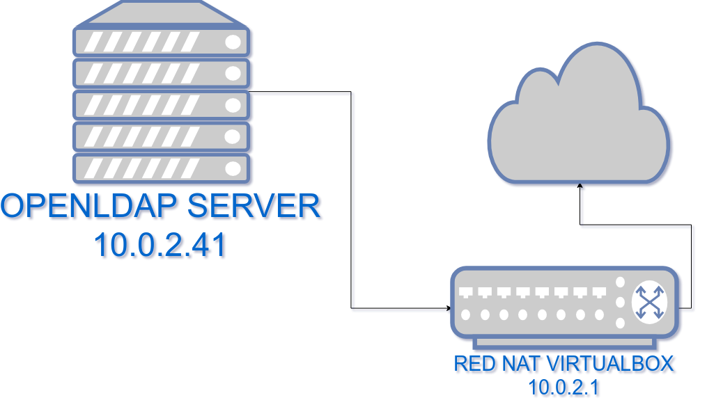
\

La IP del servidor de OpenLDAP hasta ahora ha sido configurada via DHCP (dinámicamente), es conveniente que esto no sea así, ya que necesitaremos que la IP no cambie con cada reinicio, así que utilizaremos la configuración de `netplan` para dejar la IP estática.

Moveremos el fichero que se encuentra en :

`/etc/netplan/` 

que configura la red para que sea gestionada por en NetworkManager y lo llamaremos:

`02-nat-iso-static.yaml`

Y estableceremos la configuración que se muestra:

* Gestion de la red **networkd**
* Tarjeta de red principal - 10.0.2.41
* Servidores de DNS: 8.8.8.8 y 8.8.4.4
* Rutas (Gateway) : 10.0.2.1


\

Recordad que es un fichero _yaml_ y que los espacios importan para la configuración, ya que delimitan los diferentes ámbitos de aplicación de los parámetros del fichero.

Una vez tengamos la configuración de la red escrita, la aplicaremos con:

```shell
sudo netplan apply
```

Una vez tengamos la red configurada, cambiaremos el hostname de la máquina por:

`valencia`

Y en el fichero `/etc/hosts`

Estableceremos la dirección 10.0.2.41 como `valencia.iso.com` de tal manera que podamos resolver de manera local esa dirección a nuestra tarjeta de red.

Comprobar mediante :

```shell
ping valencia.iso.com
```

Que el "cliente" es capaz de resolver el servidor (aunque en este caso, ambas máquinas son la misma).

Reiniciaremos la máquina.

## Instalación de LDAP Client

Ahora que tenemos la red correctamente configurada, instalaremos los paquetes necesarios para configurar un sistema como cliente de LDAP.

```shell
sudo apt install libnss-ldap libpam-ldap ldap-utils
```

A continuación se muestran las diferentes pantallas de configuración del paquete ldap-auth-config, que nos permitirá validarnos contra el LDAP.

El primer parámetro de configuración es la URI que nos indica qué servidor de LDAP vamos a utilizar, en nuestro caso, si hemos configurado correctamente la red, debemos usar:

`ldapi:///valencia.iso.com`

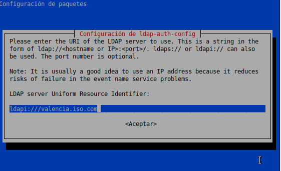
\

A continuación indicaremos la base de la búsqueda para los usuarios del LDAP. (Nuestro árbol del LDAP).

DNS => `valencia.iso.com`

LDAP => `dc=valencia,dc=iso,dc=com`

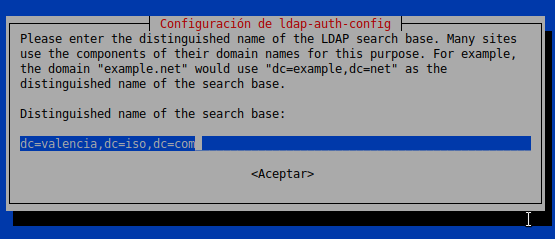
\

La versión de LDAP que utilizaremos (3)

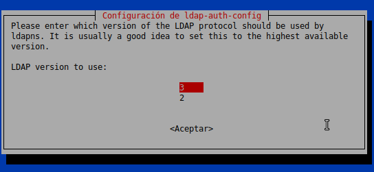
\

Aquí seleccionaremos que el usuario `root` local es administrador de la base de datos, pudiendo cambiar passwords de cuentas que se encuentren en el LDAP.

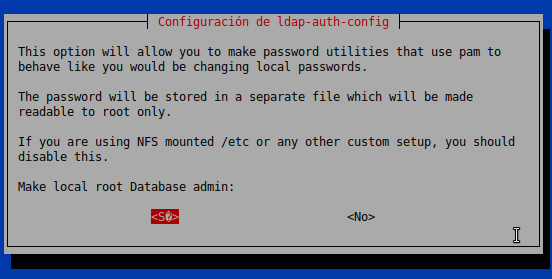
\

En este paso indicaremos que **No** queremos introducir nuestro usuario y password para realizar consultas contra el LDAP.

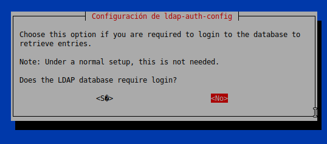
\

Ahora indicaremos qué cuenta de usuario se utilizará cuando `root` cambie un password, debemos introducir la cuenta de _administrador_ del LDAP.


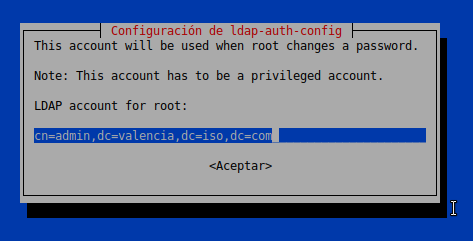
\

Estableceremos el password de esa cuenta.

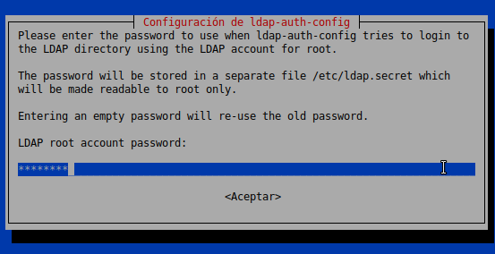
\

## nsswitch

Una vez instalados y configurados los paquetes relacionados con el LDAP, debemos indicarle al sistema que los usuarios pueden ser validados contra el servidor de LDAP que hemos configurado. Para ello editaremos el fichero :

```shell
/etc/nsswitch.conf
```

Y estableceremos los valores tal y como se ven en la captura.

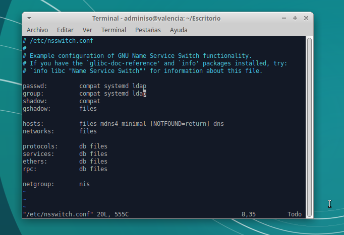
\

## PAM

Una vez tenemos el cliente de LDAP configurado, debemos indicarle al sistema modular de autenticación (PAM), cómo los usuarios de LDAP pueden iniciar sesión.

Primero debemos establecer el apartado del fichero referente al password:

`/etc/pam.d/common-password`

Para que coincida con el que aparece en la imagen (_quitar el parámetro `use_authok` de la línea 26_).

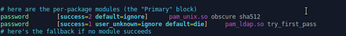
\

Y por último habilitaremos el plugin de PAM que crea el directorio personal de los usuarios cuando inician sesión en la ruta establecida.

```shell
sudo pam-auth-update
```

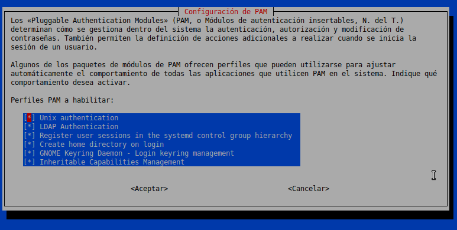
\

Si ejecutamos ahora el comando:

```shell
getent passwd
```

aparecerán los usuarios del LDAP además de los usuarios _locales_. 

## Comprobación 

Si ejecutamos el comando:

`su esbirroldap01` 

Y a continuación la ejecución de los comandos: `whoami` y `pwd`, nos deben devolver algo similar a esto:

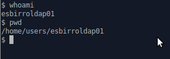
\

## Lightdm

Estableceremos en la configuración del gestor de entrada que podamos introducir el login del usuario, permitiendo así que podamos iniciar sesión con los usuarios **no locales**.

Crearemos un fichero de configuración en el directorio de configuracion (`lightdm.conf.d`), que contenga en su nombre indicaciones acerca de su propósito y cuyo contenido sea el de la imagen.

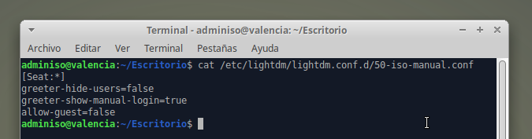
\

Reniniciaremos el servicio _lightdm_ (o el sistema), y el _lightdm_, nos debe permitir iniciar sesión con "otros" usuarios diferentes a los locales.

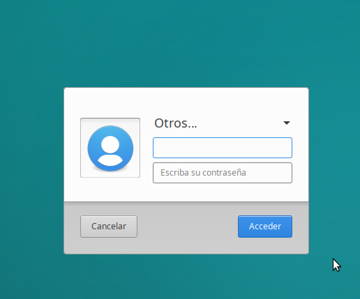
\

## Cambio de uid

Debemos cambiar el `uid` del usuario de LDAP para que **no coincida** con el de los usuarios locales de la máquima.

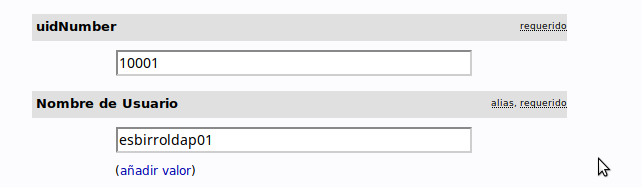
\

## Ejercicio 1

Realiza todos los pasos descritos en la práctica, adecuandolos a tu infraestructura y documenta los cambios que has realizado para ello.

## Ejercicio 2

¿Porqué no debemos tener varios usuarios con el mismo `uid`? Razona la respuesta.

## Ejercicio 3 (Ampliación)

Instala otra máquina GNU/LinuX y sigue estos pasos para transformarla en cliente de LDAP.

Elige una distribución diferente de GNU/LinuX si así lo deseas.

Documenta las diferencias de configuración que puedas encontrar respecto a Ubuntu.

