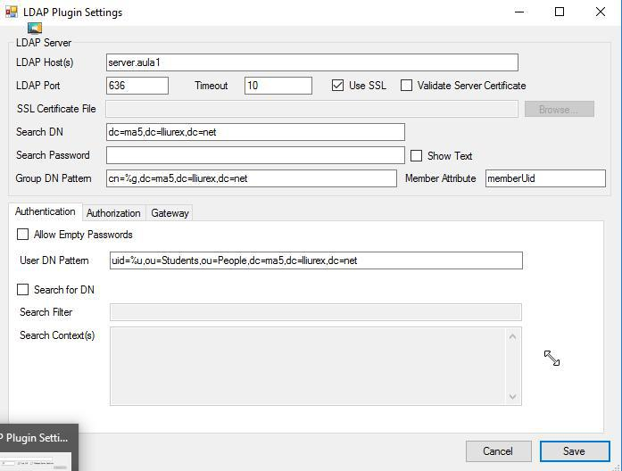
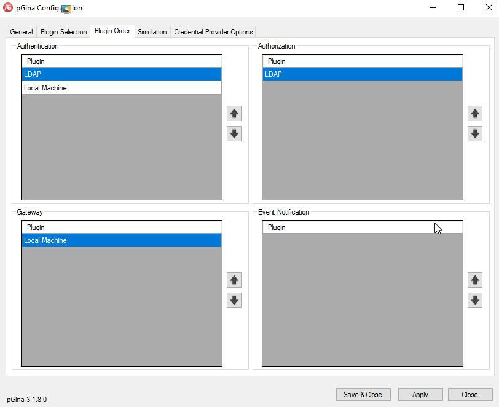
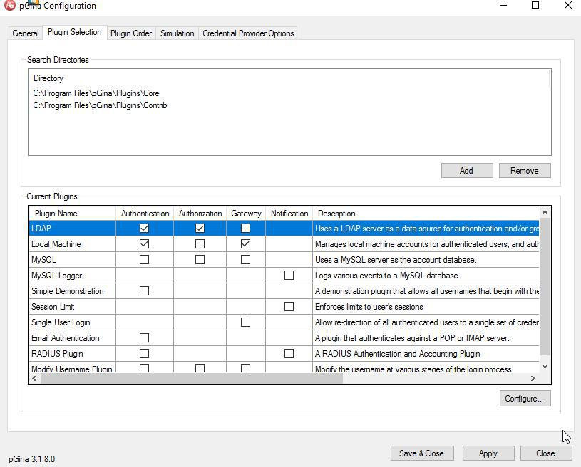

# Tarea Ampliación : PGina + LliureX

Aprovechando que en el Centro disponemos de un modelo de Aula LliureX en las aulas de informática de Secundaria, realizar la configuración del Servicio `PGina` o `PGina Fork` para permitir el login de los usuarios de la `ou=Students` en Windows.

En las capturas se muestran los diferentes parámetros de configuración que han de estar establecidos.

\ 

\ 

\ 

# Ejercicio 1

Realiza la instalación y configuración de `PGina` en una MV con Windows 10 y comprueba que puedes iniciar sesión con usuarios de LliureX.

Documenta el proceso seguido.

# Ejercicio 2

¿Qué cambios deberías realizar para permitir tan solo el login de los *profesores*? 
