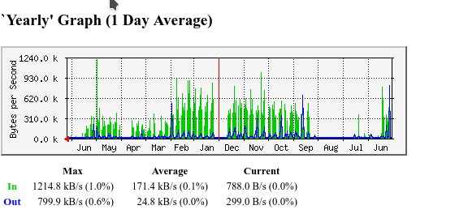
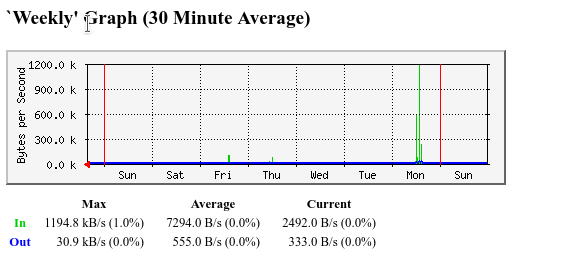
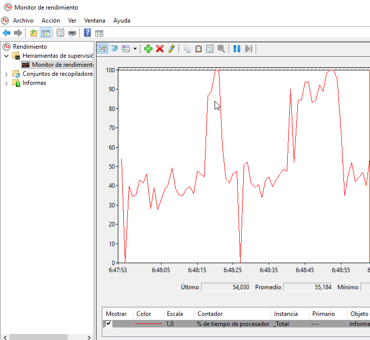
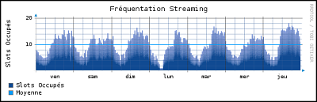
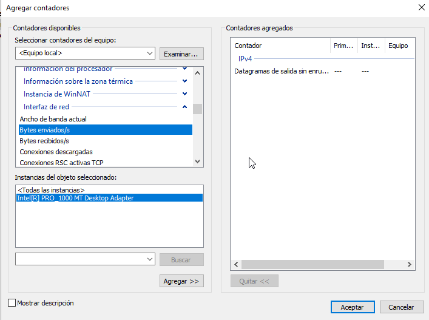
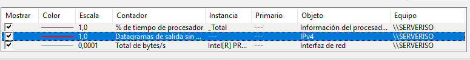
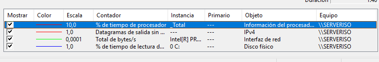

# Tarea: Monitor de Rendimiento Windows 2019

Utilizando la máquina de Windows Server 2019, crearemos diferentes monitores de rendimiento 
para ser capaces de detectar posibles problemas y configuraciones erróneas en los diferentes
servicios y funcionalidades.

## Paso 1

Como usuarios **Administradores del Dominio**, entraremos en la ventana de Administración del Servidor, y en 
el apartado _Monitor de Rendimiento_.

La ventana que nos aparece es la siguiente:

\

En esta ventana se nos explica qué es un monitor de rendimiento y cuáles son las funciones que nos permitirá esta herramienta.

En clase muchas veces hemos visto ya este tipo de herramientas:

* Nagios
* Las gráficas MRTG del Servidor del Aula

\

\

Pero esta vez vais a ser vosotros los que configuréis los gráficos e informes que aparecen.

En el apartado de _Resumen del Sistema_ aparecen datos relativos a lo último que ha ocurrido en el sistema.

## Paso 2 

Al hacer clic en _Herramientas de Supervisión_ -> _Monitor de Rendimiento_ , en un primer momento aparece un cuadro en blanco, pero se va dibujando una gráfica de consumo de CPU a medida que pasan los segundos.

\

Esto ya lo hemos visto antes (*MRTG*), pero en aquél caso era el tráfico de Red que manejaban las diferentes tarjetas físicas del Servidor del Aula.

Este tipo de Gráficos se conocen como **RRDtool**, y se trata de un estándar de la industria.

\

Vamos a añadir nuevos elementos a la monitorización.

Pulsando el botón de (**+**) que aparece arriba en la ventana nos aparece un desplegable con todas las opciones que Windows 2019 nos permite monitorizar. Vamos a añadir 3:

* [IPV4] Datagramas de Salida sin enrutar.
* [Interfaz de red] Total de bytes por segundo.
* [Disco Físico] % de tiempo de lectura.

\

A medida que los vamos añadiendo van apareciendo en el gráfico.

\

\

Podemos seleccionar características cómo:

* Color en el que aparecen.
* Escala de los valores seleccionados.
* Equipo sobre el que se efectúa la monitorización.

# Ejercicios 

## Ejercicio 1

Sigue los pasos descritos en la tarea y configura un monitor de rendimiento para tu instalación de Windows.

## Ejercicio 2

Teniendo en cuenta que ese servidor Windows ofrece los servicios de Active Directory, realiza un monitor de rendimiento que visualice los servicios asociados a él.

* DHCP
* DNS

## Ejercicio 3

Supongamos ahora que necesitamos monitorizar un servidor de Virtualización que utiliza *Hyper-V*.

Busca en Internet cuáles son los requisitos y los cuellos de botella habituales y configura un Monitor de rendimiento adecuado.

Avisa al profesor cuando hayas realizado estos tres ejercicios.

## Ejercicio 4

Por parejas, configurar un monitor de rendimiento que mida 5 indicadores sobre los ficheros compartidos que hemos realizado en prácticas anteriores.

Avisad al profesor cuando hayáis finalizado.

## Ejercicio 5 (Ampliación)

Si habéis configurado el iniciador *iSCSI* de Unidades anteriores, preparar un Monitor de rendimiento para visualizar su uso. 

