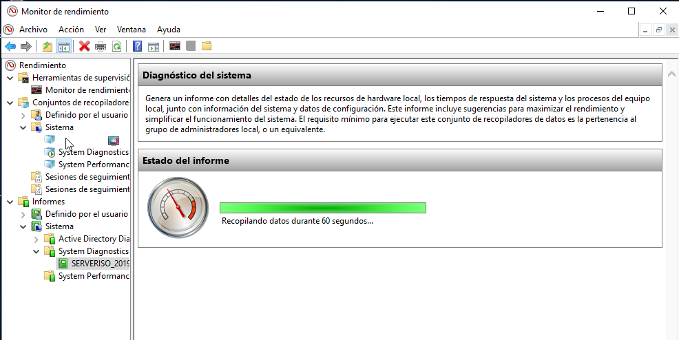
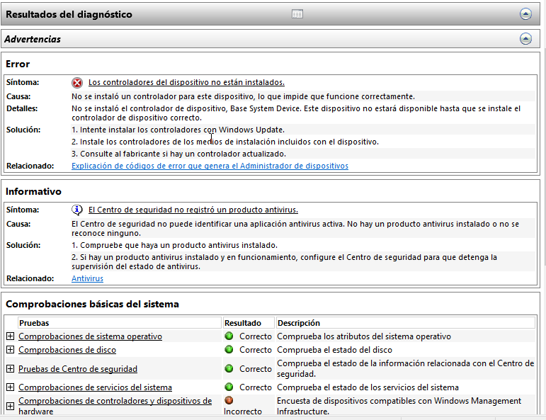
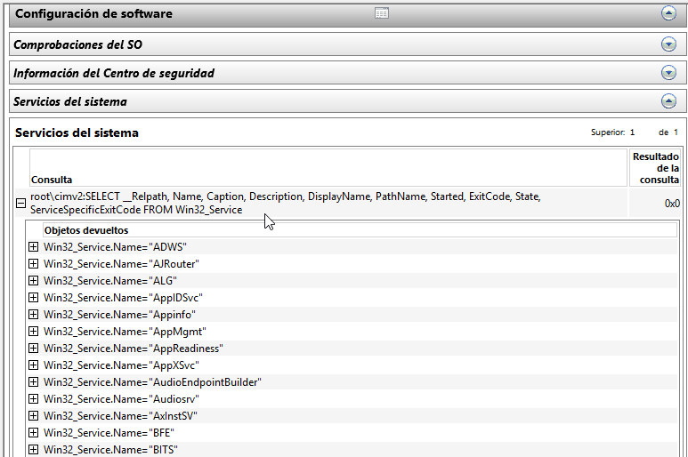

# Tarea: Recopilación del Estado del Sistema

En Windows, se permite la ejecución de una serie de tests, que realizan un breve resúmen de todo el estado del sistema, o de lo que se haya configurado.

En esta práctica realizaremos un pequeño resumen y extraeremos algunas conclusiones acerca de los datos obtenidos.

## Paso 1

Para ver las recopilaciones, debemos ir a la misma ventana que en la tarea del **Monitor de Rendimiento**.

\

Si accedemos al apartado de *Informes* por primera vez, este aparece vacío, esto es así porque no se ha ejecutado nunca ningún recopilador de datos.

Vamos a ejecutarlo ahora y veremos algunos detalles del informe.

Iremos al apartado : *Conjuntos de recopiladores* -> *Sistema* y ejecutaremos un *Diagnóstico del Sistema*.

Se trata de un proceso que tarda unos segundos en ejecutarse.

\

Si accedemos al apartado *Informes*, tal y como se muestra en la imágen nos indica que se está ejecutando el recopilador de datos.

Una vez concluido nos muestra un Informe completo del estado del Sistema.

\

Indicándonos problemas y advertencias que són muy útiles para diagnosticar y prevenir posibles problemas y ataques de seguridad.

Las diferentes comprobaciones se pueden ir *navegando*, pulsando en los botones de (**+**) y podemos ir leyendo toda la descripción de las mismas.

\

En esta última captura se muestran los diferente servicios del sistema y se nos indica la ruta y la consulta via *PowerShell* que debemos realizar para poder acceder a estos datos.

# Ejercicios 

## Ejercicio 1

Realiza los pasos descritos y comprueba que no tienes errores ( o los menos posibles) en el sistema.

## Ejercicio 2

En el caso de que aparezca el error que ha aparecido en la imágen anterior, el de : _Los controladores de dispositivos no están instalados_.  Soluciona el error con todo lo aprendido en clase.

Para verificar que el problema ha desaparecido, vuelve a ejecutar el _Recopilador_.

Avisa al profesor cuando lo hayas solucionado.

## Ejercicio 3

Respecto a la seguridad, a nivel _Informativo_ nos indica que no tenemos instalado ningún _Antivirus_. ¿Qué podemos hacer?

Investiga una posible solución y realiza un _breve_ manual para aplicarla.

## Ejercicio 4

Crea un _Informe Definido por el usuario_ que contenga información relativa al estado de las interfaces de red.

## Ejercicio 5

Crea un _Informe Definido por el usuario_ que contenga información relativa al estado de los discos y unidades de almacenamiento que tiene el sistema.

