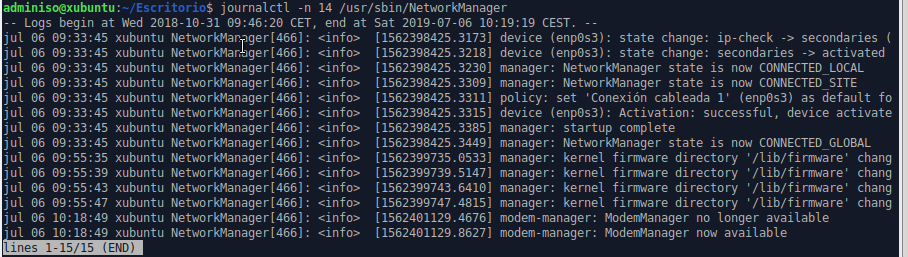
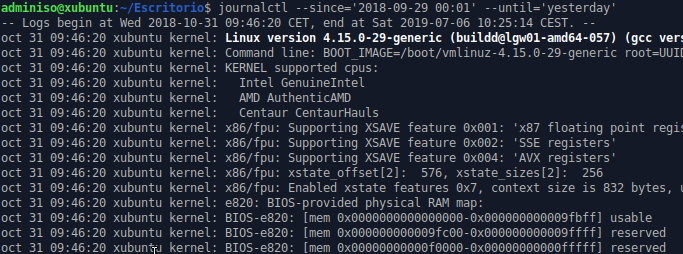

# Tarea: Registro en GNU/LinuX II

A partir de la llegada de `Systemd` como gestor de servicios y arranque, la consulta a los logs via `syslog` ha sido poco a poco reemplazada por una herramienta muy potente que nos permite el acceso más **directo** a determinados mensajes.

En esta tarea vamos a trabajar con `journalctl`.

## journalctl

`journalctl` nos permite acceder a los registros del sistema de una manera muy cómoda y lleva los filtros *incorporados*.

La ejecución de `journalctl` _sin argumentos_ equivale al comando:

```
cat /var/log/messages |less
```

Los diferentes argumentos que le pasemos a `journalctl` nos permitirán extraer la información.

Vamos a presentar los diferentes filtros y se pide la realización de un ejercicio relativo a dicho filtro.

### Tiempo Real

Para monitorizar en tiempo real lo que va ocurriendo (similar al comando: `tail -f /var/log/messages`), podemos ejecutar:

```
journalctl -f
```

### Listar los diferentes arranques

Para ver un listado de los últimos arranques del sistema podemos ejecutar:

```
journalctl --list-boots
```

#### Ejercicio 1

Comprueba que arranques ha tenido tu equipo en la última semana.

### Logs del arranque actual

Para ver los logs relativos al *current* arranque, podemos ejecutar:

```
journalctl -b
```

Si se le indica un número negativo, cuenta ese número de arranques _hacia atrás_ y muestra esa información.

```
journalctl -b -4
```

#### Ejercicio 2

¿Qué orden deberiamos ejecutar para ver los mensajes relativos al dispositivo /dev/sda1 en el arranque justo anterior al actual?

### Logs del kernel

El parámetro `-k` filtra los mensajes sólo del _kernel_.

Se pueden ir _añadiendo parámetros_, así que....

#### Ejercicio 3

¿Qué orden deberíamos ejecutar para ver los mensajes relativos al _kernel_ del arranque justo anterior al actual?

### Número de Líneas

```
journalctl -n 42
```

Mostrará las últimas 42 líneas del log.

### Log de un programa

Podemos filtrar los logs por *programa* que lo ha creado, indicándole la ruta del mismo.



#### Ejercicio 4

Realiza un Shell Script que muestre las últimas 10 entradas del registro de los siguientes programas:

* scite
* firefox
* NetworkManager
* sensors

### Log de un usuario

Indicándole el parámetro _UID=uidDelUsuario podemos filtrar por él.

```
journalctl _UID=1000
```

#### Ejercicio 5

Realiza un Shell Script que muestre los logs relativos al usuario **root**.

#### Ejercicio 6 (Ampliación)

Realiza un Shell Script que muestre los logs relativos a todos los usuarios de un grupo que se le indica como argumento.

### Logs por fechas

Podemos filtrar muy cómodamente for fechas, por ejemplo:

```
journalctl --since 'yesterday' --until '12:00'
```

Nos filtrará los eventos realizados desde ayer hasta las 12:00 de hoy.

Otro ejemplo sería indicando la fecha:



### Logs por unidades de Systemd

Se permite también ver los logs por unidades de `Systemd`.

```
journalctl -u sshd.service 
```

#### Ejercicio 6

¿Qué comando ejecutarías para mostrar los registros del NetworkManager que ocurrieron en las últimas 36 horas?

#### Ejercicio 7

¿Qué comando ejecutarías para mostrar los registros del NetworkManager que ocurrieron en la últimas semana (puedes poner fechas)?

#### Ejercicio 8

¿Qué comando ejecutarías para mostrar los registros del usuario `adminiso` que ocurrieron ayer?

#### Ejercicio 9

Busca en Internet información acerca de un visor de logs gráfico e instálalo  en la máquina virtual. Realiza un pequeño manual de uso.

