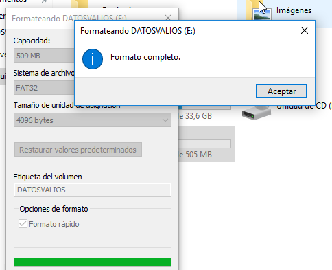

# Tarea: Forense Básico

En esta práctica vamos a trabajar con una imágen de disco duro que simulará un disco que nos acaba de traer un cliente.

El objetivo es rescatar unos datos que por error este cliente ha borrado.


\ 

## Conexión del disco duro

El disco se llama **DatosValiosos.vdi** y lo podéis descargar desde el servidor de datos.

``` shell
http://172.29.0.254/repositori/forense/
```

Lo conectaremos a la máquina virtual con Windows 10 y pondremos en marcha el sistema.

## Herramientas forenses

Una de las herramientas forenses más famosas es *Recuva* que viene de la suite de *CCleaner*. En estas prácticas vamos a utilizar la versión **Freemium**.

## Pasos de la investigación

Una vez tengamos el disco duro conectado al equipo (estamos simulando que el cliente viene con el disco duro/USB en la mano). Y tengamos el software instalado en Windows, procedemos a obtener información acerca del incidente.

* ¿Qué ha pasado?
* ¿Cómo han sido borradas?
* ¿Ha sido manipulado a continuación el disco?
* ¿Se ha continuado usando o ha venido directamente hasta aquí?
* ¿Qué archivos desea recuperar?

El profesor hará de cliente en este apartado.

## Entrega

Realizar un informe detallando el proceso que se ha seguido para restaurar los datos.
