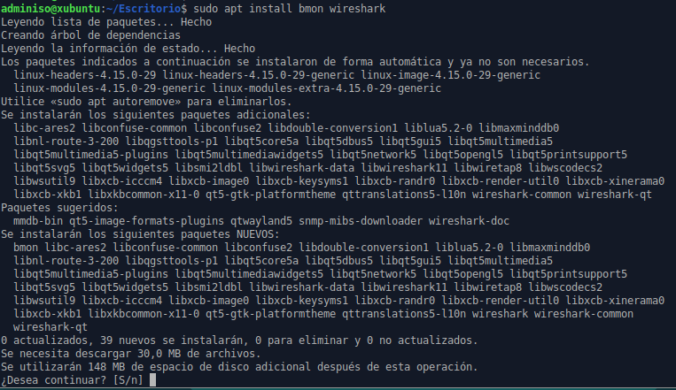
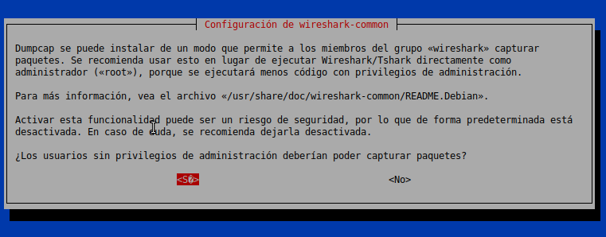
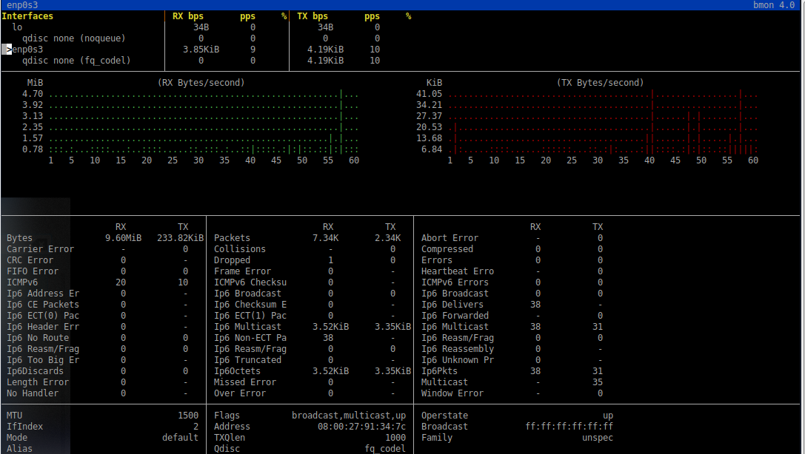
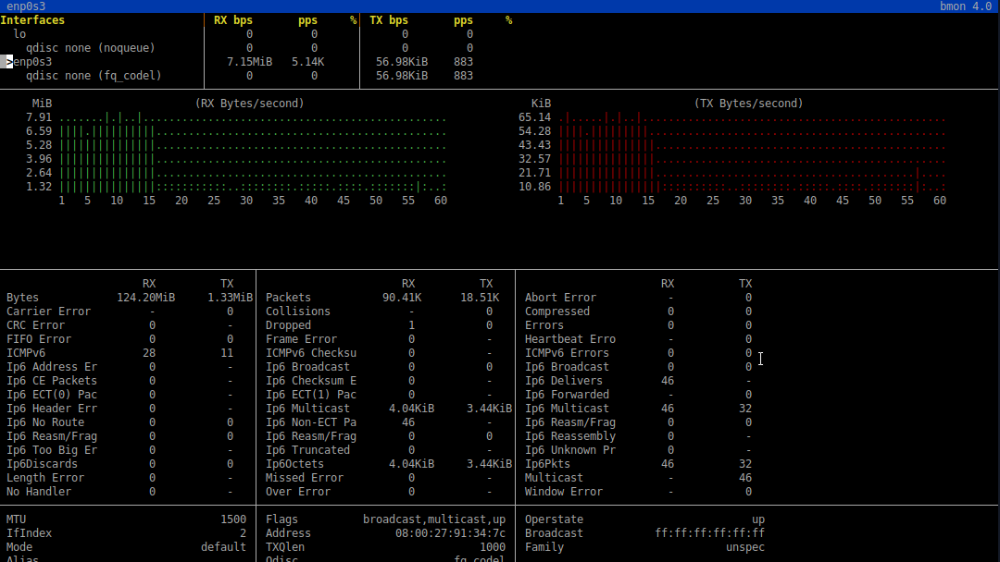
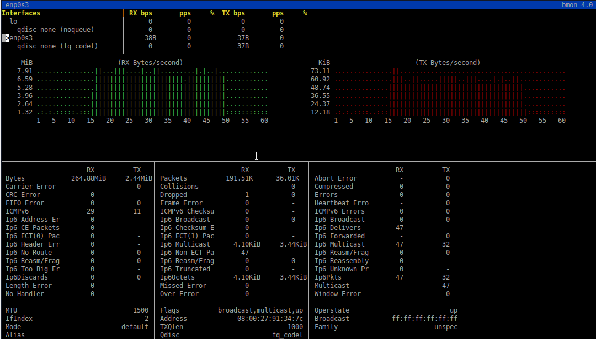
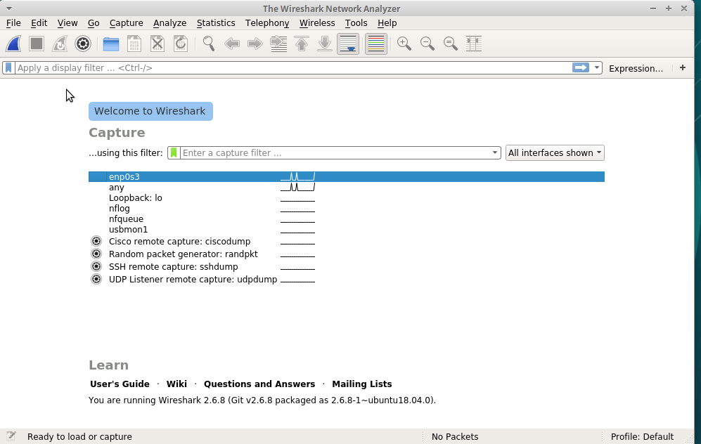
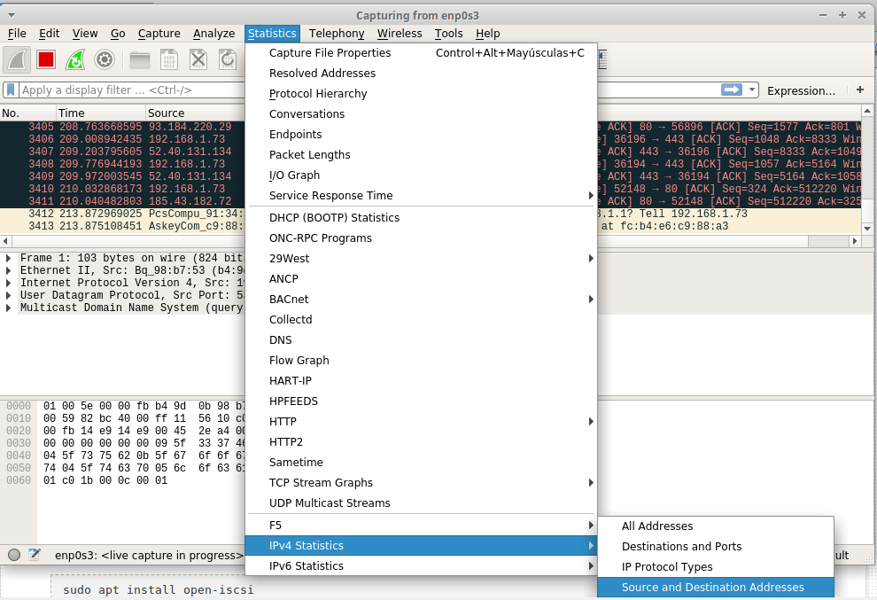
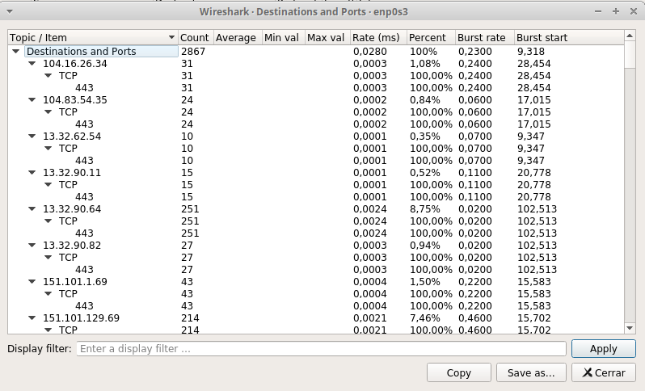

# Tarea: Monitorización de la red

El objetivo de esta tarea es conocer diferentes modos de monitorización de la Red, y obtener datos que pueden resultar muy útiles a la hora de diagnosticar un determinado problema.

En esta tarea trabajaremos por parejas para poder realizar todas las 
actividades que están descritas aquí. 

Configurar la tarjeta de red de las máquinas de tal modo que podáis ver la máquina de vuestro compañer@.

## Instalación del Software

En la máquina donde teneís instalado el NFS o en su defecto en una máquina Ubuntu cualquiera debéis instalar los siguientes paquetes:

* bmon
* wireshark

Tal y como aparece en la imágen siguiente:


\

Cuando nos realice una pregunta acerca de la posibilidad de que los usuarios que ejecuten el programa `wireshark` no necesite privilegios de administrador, contestar lo que consideréis, pero tenerlo en cuenta más adelante para lanzarlo.


\

Una vez esté instalado pasaremos a realizar los siguientes pasos.

## bmon 

se trata de un software de monitorización de red bastante básico, pero puede ser más que suficiente para realizar una monitorización activa de una determinada interfaz en dispositivos que carecen de interfaz gráfica (*Raspberry PI*).

Al lanzarlo con la orden :

```
sudo bmon

```

Nos indica que debemos elegir una interfaz de red para ser monitorizada

Si pulsamos las teclas : **d** e **i** aparece información extendida que será con la que trabajaremos en esta práctica.


\

Si seleccionamos nuestra tarjeta de red (_no loopback_), podremos ver que el gráfico de tasa de transferencia va apareciendo y se muestran valores en las dos secciones de colores (_verde_ y _rojo_).

Si accedemos mediante el navegador web de la máquina virtual al servidor del aula y descargamos cualquier fichero `.iso`, para generar tráfico,debe aparecer algo similar a esto al cabo de unos segundos:


\

Al detener la descarga, el gráfico resultante es el siguiente:


\


### Ejercicio 1 

¿Qué podemos apreciar?

Realizad la actividad descargando una imágen `.iso` desde el servidor del aula y luego desde Internet. 

Comparar resultados.

### Ejercicio 2

Si dejamos el monitor `bmon` monitorizando durante un periodo de tiempo, mientras navegamos por Internet,  el tráfico sigue incrementándose. Acceder a un video de YouTube y comprobar cuantos _bytes_ ha descargado.

## Wireshark

Se trata de uno de los Software de Monitorización y análisis de red más famosos, pero nosotros lo veremos de manera sencilla, con el objetivo de mostrar la cantidad de tráfico utilizan algunos de los diferentes protocolos vistos en el módulo.

Para lanzarlo, debemos hacerlo con privilegios para capturar páquetes de las diferentes tarjetas de red (_la pregunta de antes_).

Las opciones son :

```
sudo wireshark
```

o 

```
wireshark
```

en caso de que hayamos permitido a los usuarios capturar paquetes. (Recordar que siempre que asignamos permisos a un grupo, estos _no_ se hacen efectivos hasta que no salimos y volvemos a entrar en la sesión).

Una vez con el programa en marcha, la interfaz es esta:



\

Si seleccionamos nuestra tarjeta de red _enp0s3_ , veremos que comienzan a aparecer los diferentes paquetes y datagramas que forman el tráfico de dicha tarjeta.

Si minimizamos el Wireshark y continuamos navegando durante unos minutos, y  a continuación vamos al menú *Statistics* y seleccionamos la opción:


\

*IPv4 Statistics -> Destination and Ports*

Nos aparecerá un resumen de red similar a este:


\

Donde aparecen las diferentes IPs a las que hemos contactado, cuantos paquetes han sido transferidos y además el Puerto al que nos hemos conectado.

Esto es especialmente útil para comprobar el tráfico de destino,origen y sus puertos.

### Ejercicio 3

Realizar los pasos descritos y guardar el Resumen en un fichero.
¿Qué 3 puertos aparecen más habitualmente?

### Ejercicio 4

Desde la máquina del compañer@ realiza diferentes `telnet` (buscar en internet información) a diferentes puertos con el objetivo de que aparezcan en el resumen. ¿Aparecen? 

Avisad al profesor cuando lo logréis.


