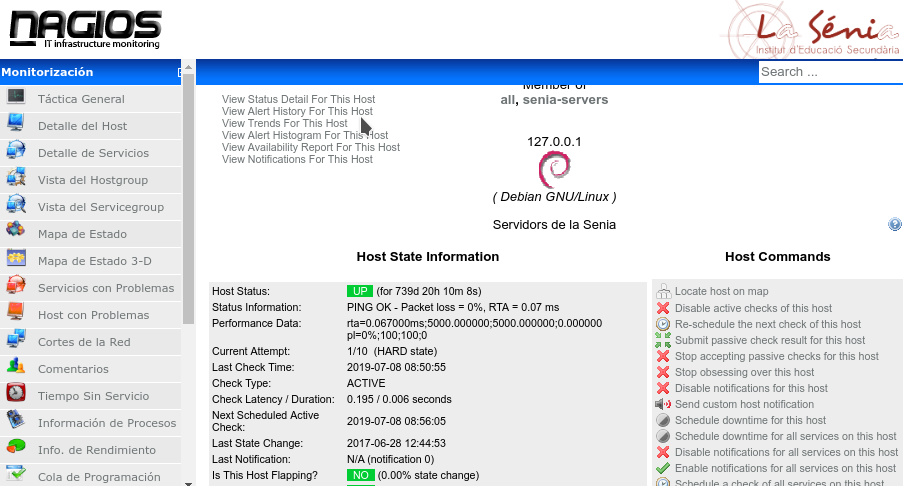
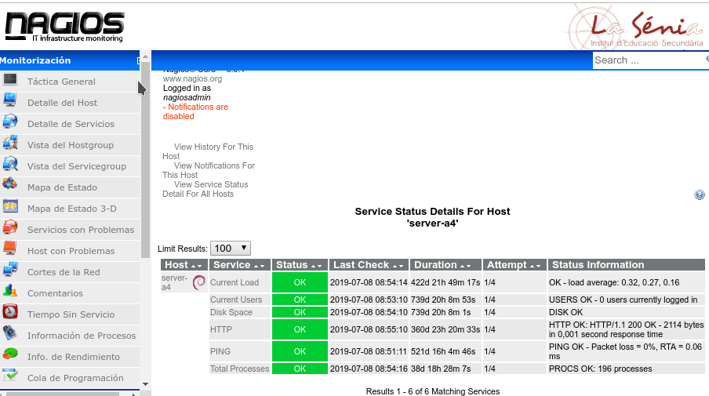
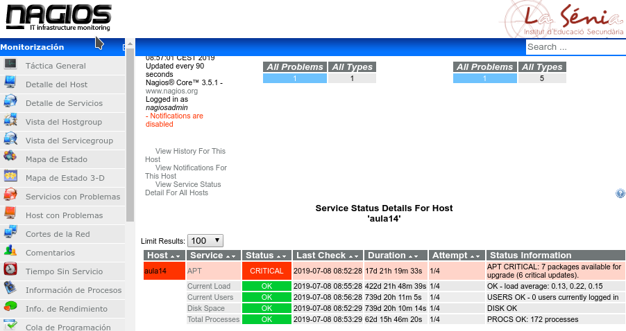

# Tarea: Nagios

En esta tarea cada uno de vosotr@s entrará en la página de alertas de Nagios de uno de los ordenadores del aula y evaluará los datos más importantes, así como las alertas configuradas.

Recordad, que la dirección del Servidor Nagios es:

http://172.29.0.254/nagios3

El usuario que tenéis es :

alumno01:alumn01 
alumno02:alumn02
...

Respecto al orden que establecimos en clase.

## Pasos

Información del servidor Nagios

\

\

Ahora iremos al equipo que nos corresponde:

\

Examinaremos todos los detalles de la máquina y comprobaremos sus alertas.

### Ejercicio 1

Describe de manera detallada las diferentes comprobaciones que se realizan sobre el equipo.

¿Por qué crees que son importantes esas alertas?

### Ejercicio 2

En caso de que los indicadores de alerta nos avisara de que algo fuera mal. ¿Cómo resolveríamos el problema?

### Ejercicio 3

Existen muchísimas comprobaciones que podemos realizar, adecuándonos a la realidad y al problema que intentamos resolver.

Busca en la página Web de Nagios plugins para:

* Antivirus
* NTP
* SSH
* Conectividad con el LDAP

### Ejercicio 4

Instala el cliente de Nagios en la máquina Xubuntu y configuralo para que el Servidor Nagios del Aula pueda monitorizarlo.

Avisa al profesor cuando lo hayas realizado. Prepara la IP de la máquina.
