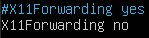
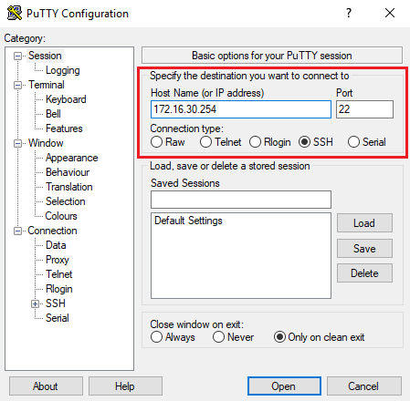
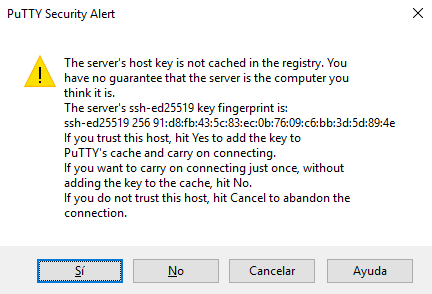
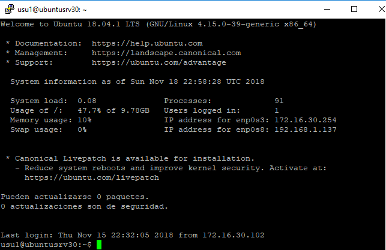

# Tarea: Servidor SSH Linux y Clientes SSH

SSH proviene de *Secure SHell*, es decir, intérprete de órdenes seguro y
su objetivo es justamente ese: acceder remotamente a una máquina a
través de una conexión segura y gestionarla a través de un intérprete de
comandos. Además, SSH permite redirigir las X (el entorno gráfico), es
decir, ejecutar aplicaciones gráficas redirigiendo la visualización de
dichas ventanas a la máquina desde la que accedemos aunque, obviamente,
necesitamos tener las librerías gráficas instaladas en la máquina remota
para poder mostrar dichas ventanas.

En esta práctica vamos a instalar y configurar un servidor SSH en una
máquina Linux. Posteriormente usaremos varios clientes para conectarnos
al servidor SSH.

Recuerda de la configuración de la red debe ser la correcta para poder ir realizando los pasos que de describen (NAT,modo puente,...). 

## Instalación del servidor SSH

La instalación del servidor se realiza a través del siguiente comando:

```shell
sudo apt update
sudo apt install openssh-server
```

Una vez realizada la instalación, las claves públicas y privadas son
generadas automáticamente para los cuatro algoritmos de encriptación
soportados por la versión SSH2 (RSA, ECDSA y ED25519):

Las claves generadas se encuentran en el directorio /etc/ssh/. Cada
clave tiene el siguiente aspecto:

* ssh_host_xxx_key -> Clave privada
* ssh_host_xxx_key.pub -> Clave pública

Dónde xxx es el algoritmo de encriptación para la que va destinada la
clave. Ahora ya podemos probar conectarnos desde cualquiera de nuestros
equipos clientes.

## Clientes SSH en Ubuntu

La mayoría de las distribuciones Linux ya llevan el cliente SSH
instalado por defecto. Podemos comprobar si el paquete está instalado
ejecutando el siguiente comando:

`sudo apt search openssh-client`

Como se puede observar, nuestra máquina Ubuntu ya lleva el paquete
instalado. No obstante, si tuviésemos que instalar el cliente por
consola, basta con actualizar el listado de paquetes disponibles y
ejecutar el siguiente comando de instalación:

```shell
sudo apt update
sudo apt install openssh-client
```

Para realizar una conexión a un servidor SSH remoto, tenemos que
ejecutar el siguiente comando:

```shell
ssh <usuario>@maquina_remota
```

Se nos solicitará a continuación la contraseña de dicho usuario. Es
importante comentar que **el usuario debe ser un usuario válido en la
máquina remota**, y la contraseña a utilizar será la contraseña del
usuario dentro de la máquina remota. Esto es importante pues puede darse
el caso de que en la máquina local y en la máquina remota exista el
mismo usuario. Si es el caso, debemos tener en cuenta que, cuando
hagamos la conexión, tendremos que usar la contraseña que tiene el
usuario en la máquina remota.

La primera vez que se realiza la conexión a una máquina, es necesario
aceptar su clave pública. Le decimos que **yes**. A continuación se nos
preguntará la contraseña del usuario. La introducimos y si la contraseña
es correcta, estaremos dentro de la máquina remota:

**Nota** : Ahora podremos ejecutar cualquier comando excepto aquellos que
carguen una interfaz gráfica. Más adelante veremos cómo redirigir el
entorno gráfico hacia la máquina desde la que nos conectamos.

Para cerrar la conexión, basta con ejecutar el comando de cierre de
sesión: `exit`.

## Limitar qué usuarios se pueden conectar por SSH

Por defecto, el servidor SSH permite que cualquier usuario válido en el
sistema pueda conectarse remotamente. No obstante, hay ocasiones en las
que no interesa que cualquier usuario pueda manipular nuestra máquina de
manera remota. En estos casos, puede limitarse los usuario que pueden
acceder remotamente modificando el fichero de configuración

```
/etc/ssh/sshd_config.
```

Para probar esto último, vamos a realizar lo siguiente:

1. Vamos a dar de alta tres nuevos usuarios en la máquina servidora
(*usu1, usu2 y usu3*).

2. Vamos a permitir el acceso SSH a los usuarios *usu1* y *usu2*.

3. Vamos a probar el acceso de los tres usuarios a través de una de las
máquinas clientes.

Para dar de alta al usuario *usu1*, con contraseña *usu1*, ejecutamos el
comando: adduser, tal y como hemos visto en unidades anteriores.

Repetimos el proceso con *usu2* y *usu3*.

A continuación, modificamos el fichero sshd_config y añadimos, al final
del fichero, la línea :

```shell
AllowUsers <usuario1> <usuario2>...
```


\

Después, reiniciamos el servicio SSH.

Si probamos con el usu3, por muchas veces que pongamos la contraseña, el servidor va a rechazar el acceso indicando que el usuario no tiene permiso _(Permission denied)_.

Vamos a probar ahora con el usuario _usu1_.

Con el usuario *usu1* **sí** que podemos entrar. Por último, comprobaremos
que también puede hacerlo _usu2_.

## Habilitar/deshabilitar el reenvío de las X

Si por alguna razón queremos evitar que se reenvíen las X a través de
una conexión SSH, basta con modificar el fichero /etc/ssh/sshd_config y
modificar la línea: X11Forwarding yes a no.



Reiniciamos el servidor y hacemos la prueba desde un cliente.

Se recomienda volver a dejarlo activado para poder conectarnos
posteriormente al entorno gráfico.

## Regenerar las claves SSH

Hay ocasiones en las que no queda más remedio que regenerar las claves
de nuestro servidor SSH. Las razones pueden ser varias: que se haya
comprometido la seguridad porque alguien haya podido tener acceso a las
claves, bien porque hayamos clonado una máquina y no queremos que la
nueva máquina tenga las mismas claves que la original, etc.

En cualquier caso, si deseamos regenerar las claves del servidor SSH, lo
primero que tenemos que hacer es borrar las claves previas. Para ello
ejecutamos el siguiente comando:

`sudo rm /etc/ssh/ssh_host_*`

Una vez borradas, generamos un nuevo conjunto de claves:

`sudo dpkg-reconfigure openssh-server`

El problema que podemos tener es que si ahora tratamos de volver a
acceder por SSH desde alguno de nuestros clientes, el cliente SSH no lo
va a permitir porque la clave no coincide.

La explicación es la siguiente:

1. Cuando un cliente se conecta a un servidor SSH, el servidor SSH le
manda su clave pública.

2. El cliente mira si ya tenía la clave pública de dicho servidor.
Pueden ocurrir dos casos:

   * Si no tiene almacenada la clave, la guarda y el cliente continúa con
    la conexión (es lo que pasa la primera vez).

   * Si la tenía almacenada, comprueba que la clave recibida coincida con
    la almacenada. Sólo si coinciden el cliente sigue con la conexión. Si
    las claves difieren, entonces el cliente muestra un error al usuario y
    aborta la conexión.

Hay que tener en cuenta que el cliente SSH vela por nuestra seguridad.
Si la clave pública que teníamos almacenada difiere de la recibida,
puede ser que simplemente el equipo remoto haya regenerado las claves
(por reinstalación, seguridad, etc.) o puede ser porque estemos
sufriendo una ataque *man-in-the-middle*.

Si estamos seguros de que no estamos sufriendo ningún ataque y que el
cambio de claves se ha hecho por alguna razón justificada, entonces
podemos arreglarlo modificando a mano el fichero `~/.ssh/known_hosts`
borrando la línea con la clave correspondiente o, lo que es más
recomendable, ejecutar el siguiente comando:

`ssh-keygen --R <servidor_ssh>`

Se crea una copia de seguridad del fichero por si acaso. Ahora ya
podemos volver a probar la conexión para ver que todo funciona
correctamente:

La configuración del SSH tiene muchas opciones.

## Comando scp

El cliente _openssh-client_ permite la gestión de un equipo remoto como
si estuviéramos sentados delante de él. Sin embargo, muchas veces lo que
necesitamos es intercambiar ficheros entre la máquina remota y el equipo
cliente. Para ello podemos utilizar la herramienta SCP (*Secure CoPy*).
Con ella, podemos copiar ficheros de manera segura, usando el protocolo
SSH.

Estudiaremos la herramienta desde dos puntos de vista:

* Descargamos ficheros de la máquina remota a nuestro equipo local.
* Subimos ficheros de nuestra máquina local a la máquina remota.

Para **descargarnos ficheros** de la máquina remota, hay que saber
primero donde están. Lo más sencillo es utilizar el cliente
openssh-client y obtener la ruta y nombre de los ficheros que
deseamos. Una vez tenemos las rutas absolutas, cerramos la sesión y
ejecutamos el siguiente comando:

`scp <usuario@maquina_remota:ruta_remota> <ruta_local>`

Obviamente, el usuario que utilicemos deberá tener permisos sobre los
ficheros o carpetas que tratemos de copiar. Por ejemplo, si queremos
copiarnos el fichero archivo.para.copiar que se encuentra dentro de la
carpeta `/home/usu1` de la máquina servidor (`10.2.1.33`) y lo queremos
guardar en la carpeta actual de nuestro ordenador cliente, ejecutaríamos
la siguiente instrucción:

`$ scp usu1@10.2.1.33:/home/usu1/<archivo.para.copiar> . `

En cambio, si lo que queremos es **subir archivos** desde nuestro
cliente a la máquina remota, el proceso es muy parecido:

`scp <ruta_local> <usuario@maquina_remota:ruta_remota>`

Al igual que antes, el usuario que utilicemos deberá tener permisos de
escritura sobre la carpeta en la que vamos a escribir. Por ejemplo, si
queremos subir el fichero `/etc/environment` de nuestra máquina local a la
máquina 10.2.1.33 y en la ruta home del usuario (`/home/usu1`) y con
el nombre archivo.subido, ejecutaríamos el siguiente comando:

`$ scp /etc/environment usu1@10.2.1.33:./archivo.subido`

Podemos conectarnos ahora a la máquina remota para comprobar que dicho
fichero se ha copiado correctamente.

## Clientes SSH en Windows

Windows no lleva ningún cliente SSH instalado por defecto, así que
tendremos que recurrir a aplicaciones de terceros.

### putty

Putty es uno de los clientes SSH de línea de comandos más utilizados.
Existe una versión tanto para Windows como para Linux. No es necesario
instalarlo. Para descargarnos la versión portable nos vamos a la
siguiente dirección:

[Putty](http://www.chiark.greenend.org.uk/\~sgtatham/putty/download.html)

Una vez instalado ejecutamos el archivo `putty.exe`:

Donde pone *Host* ponemos el nombre o IP de la máquina que nos queremos
conectar, el puerto (en caso de que sea distinto de 22) y le damos al
botón *Open*.


\

Al igual que sucedía con Ubuntu, la primera vez que nos conectamos a la
máquina remota, tenemos que aceptar su clave pública. Le damos a *Sí*
para aceptar la clave.


\

En la nueva ventana se nos solicita el nombre de usuario y la contraseña
para acceder. Recordad que debe ser un usuario existente en la máquina
remota. Una vez introducidos correctamente, estaremos dentro de la
máquina:


\

**Nota**: Al igual que sucedía con el cliente por línea de comandos de
Ubuntu, no podremos ejecutar aplicaciones en modo gráfico. Ya veremos
más adelante cómo hacer esto último.

### Interfaz gráfica :WinSCP

Uno de los clientes gráficos más utilizados para acceder a los
ficheros de una máquina a través de una conexión SSH, es el programa
WinSCP. Lo podemos descargar desde la siguiente dirección:

[WinSCP](http://winscp.net/eng/download.php)

Podemos elegir la versión ZIP portable para no tener que instalarla en
nuestra máquina. Una vez descargada y descomprimida, hay que ejecutar el
fichero `WinSCP.exe`. Como es de esperar, hay que rellenar:

* **File protocol**: dejamos SFTP (secure FTP)
* **Host name**: Nombre o IP del servidor SSH al que nos queremos
conectar.
* **Port number**: Número de puerto. Si no lo hemos cambiado en el
servidor, no hay que tocar nada (por defecto, el servidor SSH usa el
22).
* **User name y Password**: Nombre de usuario y contraseña en la máquina
remota con acceso a través de SSH

No es necesario rellenar nada más. Una vez introducidos los datos,
hacemos clic sobre el botón *Login*  y ya nos encontraremos dentro de la máquina remota, pudiendo gestionar los ficheros de manera gráfica.

Al igual que en ocasiones anteriores, la primera vez que accedemos, se
nos solicita almacenar la clave pública del servidor SSH al que nos
conectamos. Obviamente le damos a ***Yes***.

Una vez dentro, la ventana está dividida en dos paneles:

* Panel de la **izquierda**: Jerarquía de archivos de la máquina local.
* Panel de la **derecha**: Jerarquía de archivos de la máquina remota.

## Redirección de las X (entorno gráfico)

Ya hemos comentado antes que si nos conectamos a un servidor SSH por
línea de comandos, sólo podremos ejecutar aplicaciones que no carguen el
entorno gráfico. Sin embargo, esto último puede que sea deseable en
ciertos momentos.

Por ejemplo, es posible que nos queramos conectar por SSH a una máquina
en un laboratorio que esté conectada a una serie de sensores que
controlan la temperatura de un invernadero. En dicha máquina remota, hay
una aplicación gráfica que muestra las gráficas de la variación de la
temperatura en función de la hora, el día, la semana, el mes, etc. En
este caso, lo que nos gustaría es que la aplicación gráfica se ejecute
remotamente, pero que las ventanas se nos muestren en nuestra máquina
cliente. Para que esto suceda, deben cumplirse dos condiciones:

1. Que el servidor SSH permita redirigir el entorno gráfico (las X) a la
máquina cliente (Por defecto, el servidor SSH suele venir configurado
así).

2. Al realizar la conexión SSH, es necesario redirigir las X desde la
máquina remota a la máquina cliente. Sin embargo, la máquina cliente
debe tener las librerías gráficas necesarias para poder mostrar las
ventanas.

Los servidores *openssh* de Linux, vienen configurados por defecto con
redirección de las X, así que el primer punto está solventado. A
continuación veremos cómo solventar el segundo punto desde otra máquina
Linux y desde una máquina Windows.

### Ubuntu

Vamos a suponer que nos encontramos en una máquina Linux y que vamos a
conectarnos desde la línea de comandos a otra máquina Linux a través de
SSH. Para hacer la conexión redirigiendo las X tenemos que ejecutar el
siguiente comando:

`ssh --X <usuario@maquina_remota>`

Todo lo que ejecutemos desde la línea de comandos que tenga una interfaz
gráfica se redirigirá a nuestra máquina en lugar de mostrarse en el
servidor SSH.

Hay que tener en cuenta que existen varios entornos gráficos en Linux
siendo los más conocidos Gnome,KDE,XFCE. Si en la máquina cliente vamos a
mostrar ventanas de aplicaciones que se han creado para el entorno KDE,
nuestra máquina deberá tener las correspondientes librerías.

Como tanto la máquina remota como la máquina cliente tienen únicamente
el entorno XFCE, no habrá problemas en mostrar las ventanas de las
aplicaciones en la máquina cliente. Hagamos la prueba.

Vamos a conectarnos a la máquina remota redirigiendo las X:

Ahora, vamos a ejecutar la aplicación *scite* presente en la
máquina servidora. (si no instalarla,

``` shell

apt install scite

```

Como se observa, la aplicación se ha ejecutado en la máquina
servidora pero en entorno gráfico se nos muestra en la máquina cliente.

## Ejercicio 1

Sentados por parejas, y configurando la tarjeta de red en modo puente, acceder a los ordenadores de los 
compañeros y realizar los pasos descritos, adjuntar capturas de los siguientes items:

* Instalación openssh-server
* Configurar el bloqueo de usuarios
* Instalar WinSCP
* Instalar Putty

## Ejercicio 2

Crear un fichero de texto en el _home_ del usuario usu1, y mediante scp copiarlo al home remoto. Realiza una captura.

## Ejercicio 3

Configurar el Servidor SSH para que funcione en otro puerto: **2233** y copiar de nuevo el fichero del ejercicio 2, renombrándolo a: _fichero2233.txt_ en la máquina remota. Realizar la copia mediante scp.
Realiza una captura.

## Ejercicio 4

Utilizando WinSCP copiar el fichero a una máquina Windows.
Realiza una captura.

## Ejercicio 5

Utilizando la redirección de las X, lanzar un navegador Web en la máquina del compañero y descargar un fichero cualquiera.
¿Donde se almacena el fichero que acabamos de descargar?
