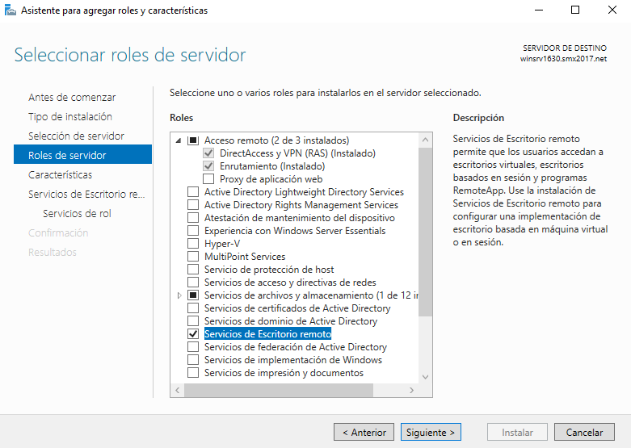
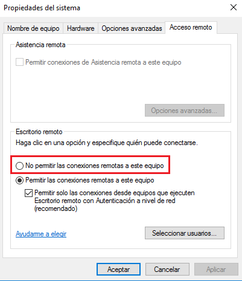
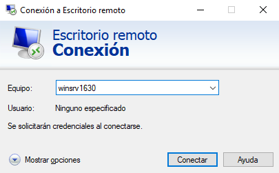
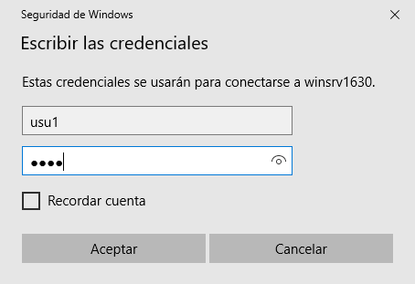
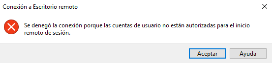
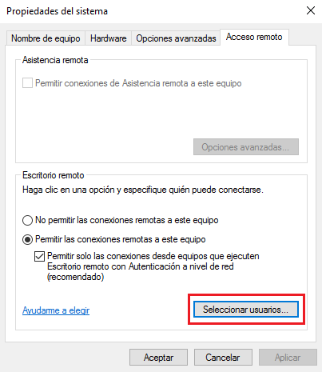
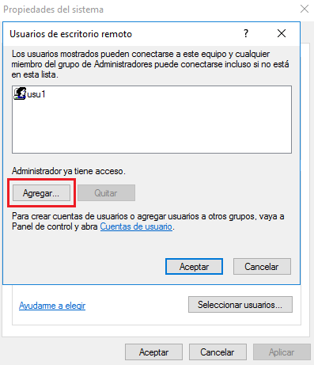
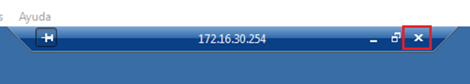
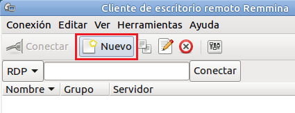

# Tarea: Escritorio Remoto

Escritorio Remoto (Terminal Server)

El servicio de Escritorio Remoto (antiguo Terminal Server) de Windows, permite que varios usuarios inicien una sesión gráfica simultáneamente en el servidor. Esta funcionalidad de inicio de sesión remota, que en UNIX era normal desde su aparición (1970), en Windows se incorporó con su versión Windows NT en 1991 a través del servicio Terminal Server.

En Windows 2019 Server este servicio se llama Servicio de Escritorio Remoto. Por tanto, si varios usuarios se conectan de forma remota al servidor, se está permitiendo la ejecución de aplicaciones desde diferentes escritorios que son mostrados en dispositivos físicamente distantes.

El servicio Escritorio Remoto consta de tres elementos.

1. El servidor (por defecto escucha en el puerto 3389).
2. El cliente. 
3. El protocolo RDP (Remote Desktop Protocol).

El protocolo RDP proporciona una interfaz gráfica de usuario para el control remoto del servidor. Se encarga de codificar y encriptar el escritorio en el servidor, y realiza el proceso inverso en el cliente, descodificación y desencriptación de las imágenes que representan el escritorio. 
Los servicios de terminal están integrados y disponibles desde la propia instalación de Windows 2019 Server. Eso sí, es necesario agregar dicha funcionalidad antes de usarla.

## Instalación del servidor

Lo primero que tenemos que hacer es instalar el rol de la misma manera que se ha hecho anteriormente con otros servicios. Seleccionamos Administrar > Agregar roles y características. Seleccionamos el  servidor y marcamos la casilla Servicios de Escritorio Remoto y pinchamos sobre el botón Siguiente:

\

El asistente nos muestras algunas características que se podrían instalar pero lo dejamos como está y pulsamos Siguiente.
Se ofrece una introducción a los servicios de Escritorio Remoto. Volvemos a hacer clic sobre el botón Siguiente y en la siguiente ventana aparecen varias funcionalidades.
Para el funcionamiento del servicio de escritorio Remoto únicamente es necesario Host de sesión de Escritorio remoto. El resto de características tiene su funcionalidad pero para hacer las pruebas no son necesarias. La marcamos y le damos a Siguiente:

\

**Nota** La Administración de Licencias en anteriores Windows Server venía integrada con la configuración del Escritorio Remoto pero ahora se debe instalar como un servicio diferente que se configura aparte.

El asistente finaliza con la información a instalar. Pulsamos Instalar para finalizar el asistente y comenzar la instalación. Finalizada la instalación reiniciamos el Servidor.

Una vez reiniciado el Servicio de Acceso Remoto  ya está operativo para conectarnos. Si en algún momento quisiéramos dejar de permitir el acceso remoto a este servidor, tendríamos que hacer lo siguiente:

_Inicio > Panel de Control > Sistema > Configuración de Acceso remoto_

Y marcaríamos la casilla _No permitir las conexiones remotas a este equipo_.  Antes de agregar la funcionalidad de Escritorio remoto, la opción que venía seleccionada era justamente esa: _No permitir las conexiones a este equipo_. Sin embargo, después de haber agregado la funcionalidad, el asistente ha modificado la configuración para poder permitir conexiones desde equipos que ejecuten cualquier versión de Escritorio remoto.

\

## Cliente Windows

El cliente de Escritorio remoto viene instalado por defecto en los sistemas Windows y puede cargarse buscando  Conexión a Escritorio Remoto o ejecutando `mstsc.exe`.
Lo que vamos a hacer ahora es arrancar nuestra máquina cliente Windows 10, abrir el cliente y realizar una conexión a nuestro servidor Windows. Cuando aparezca la ventana de conexión podemos escribir la IP de nuestro servidor.

\

Una vez presionemos el botón Conectar, se nos pedirá las credenciales del usuario. En este momento sólo podremos probar con el usuario Administrador, ya que es el único que pertenece al grupo Administradores. Si probáramos con otro usuario (usu1, usu2,…) nos denegaría el acceso.

\

\

Cambiamos las credenciales por las del Administrador y presionamos sobre Aceptar. 
La comunicación se realiza de manera cifrada, utilizando el mismo mecanismo de clave pública y privada que usa SSH. El problema es que, además, Windows genera un certificado el cual, obviamente, nosotros no hemos publicado en ninguna autoridad certificadora. Es por ello que nos pregunta si queremos aceptar dicho certificado. Presionamos sobre Sí.

Si todo ha ido bien, estaremos visualizando el escritorio del usuario con el que nos hemos validado

**Nota**: Es importante comentar que si nos hemos conectado con el mismo usuario, con el que teníamos sesión abierta en el servidor, observaremos que se ha cerrado la sesión. La razón es simple: Escritorio remoto no permite que un mismo usuario tenga el mismo escritorio abierto desde diferentes máquinas.

Se puede probar con otros usuarios creados para la práctica anterior de Windows Server. Si utilizamos otros usuarios diferentes al Administrador la sesión como Administrador NO se cerrara, ya que el nuevo usuario tiene una sesión diferente.

Para permitir que otros usuarios se conecten a Escritorio remoto accedemos al Windows Server, *Inicio > Panel de Control > Sistema > Configuración de Acceso remoto* y pulsamos sobre el botón *Seleccionar usuarios*…

\

Esto permitirá agregar nuevos usuarios de Escritorio Remoto.

\

Una vez conectado podremos finalizar una conexión de Escritorio Remoto pulsando sobre el aspa de la parte superior de la pantalla (se nos pedirá confirmación). 

\

## Cliente GNU/LinuX

Vamos a probar a acceder gráficamente a nuestra máquina Windows Server desde Linux. Cerramos nuestra máquina Windows 10 y arrancamos la máquina Ubuntu cliente. 
Ubuntu lleva instalado, por defecto, un cliente RDP llamado Remmina. Existe también otro cliente RDP muy conocido llamado tsclient el cual ofrece una interfaz más parecida a la de Windows. Nosotros vamos a utilizar Remmina ya que funciona muy bien y no es necesario realizar ninguna instalación adicional. 
Si no estuviera instalado deberíamos hacerlo como cualquier otro paquete de instalación:

`sudo apt install remmina`

Para cargar el cliente, hacemos clic sobre Aplicaciones y buscamos el programa llamado Remmina o Cliente de escritorio remoto o podemos ejecutar la orden remmina desde una terminal.

\

En la ventana que nos aparece, le damos un nombre a la conexión, nos cercioramos que está marcado el protocolo RDP, ponemos los datos de nuestro servidor Windows: IP, nombre de usuario, la contraseña y el dominio (si lo mantenemos). También podemos cambiar la resolución para reducir el ancho de banda.

Una vez rellenados los datos observaremos el escritorio de nuestra máquina Windows, y al igual que desde Windows, nos pedirá aceptar el certificado para continuar con la conexión, aparece una barra de herramientas en la parte superior que permite modificar el aspecto de nuestra conexión.

## Ejercicio 1

Realizar los pasos descritos en la práctica y comprobar que sois capaces de conectaros a todos los entornos desde todos los entornos.

Avisa al profesor cuando concluyas cada paso, para que revise la configuración y la conexión.