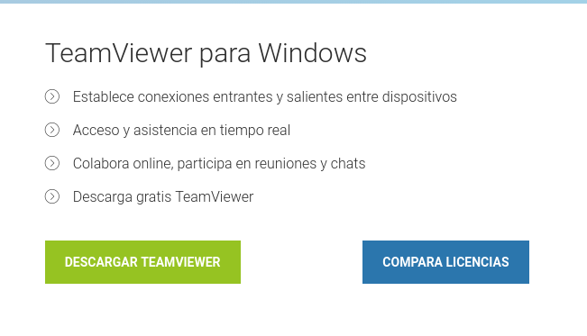
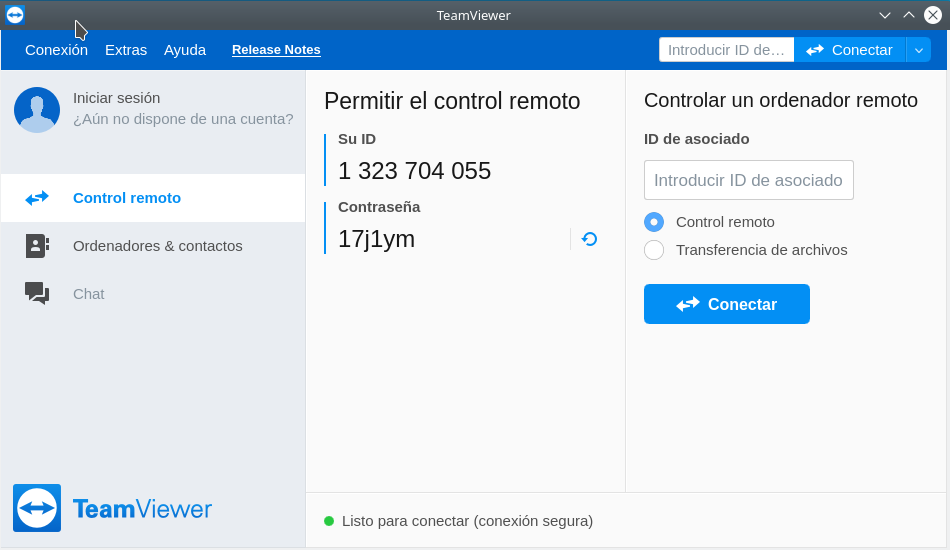
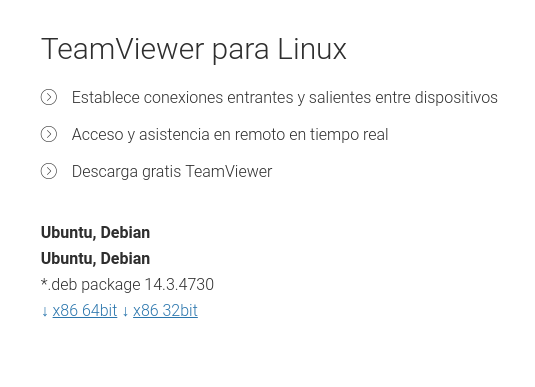

# Tarea: TeamViewer

TeamViewer es un programa que permite el control remoto de equipos tanto Windows como Linux. Es similar a VNC en funcionamiento: la autenticación se hace por contraseña (no por usuario en el equipo remoto) y el usuario que se encuentre sentado delante del equipo remoto puede ver lo que se está controlando. 
No obstante, hay algunas diferencias con respecto a VNC. La primera es que toda la comunicación se hace cifrada. La segunda diferencia, y probablemente la más importante, es que no necesita que en el router se abran los puertos para poder acceder al equipo desde fuera de la red. La razón es simple: todos los TeamViewer inician la comunicación con un servidor intermedio y le van interrogando. Cuando realmente hay una conexión entrante, el servidor intermedio responde al cliente. En ese punto, se inicia una conversión entre el equipo que quiere controlar la máquina y la máquina que va a ser controlada. 
Para permitir este sistema, desaparece la necesidad de conocer la IP de la máquina que ofrece el servicio de escritorio remoto. Ahora las máquinas tienen un ID y una contraseña (modificable por el usuario). 
Esta arquitectura permite que sólo sea necesaria una única aplicación. Una vez ejecutada, cualquier máquina puede proporcionar el servicio de escritorio remoto o usarlo. 

Aunque este sistema es de lo más cómodo y apetecible, hay que tener en cuenta que todo el tráfico pasa a través de un servidor intermedio propiedad de la compañía TeamViewer. Si bien la compañía asume que todo el tráfico es privado y no lo van a copiar ni distribuir, es posible que algunas empresas prefieran abstenerse de utilizar esta aplicación si los datos que se encuentran en la máquina remota son altamente confidenciales. 

Para probar el funcionamiento de TeamViewer, vamos a trabajar en parejas. Los alumnos A y B arrancarán primero una de sus máquinas servidoras (da igual si es Windows o Linux). A continuación, el alumno A arrancará la máquina cliente Ubuntu mientras que el alumno B arrancará la máquina cliente Windows. 

El siguiente paso es que cada alumno instale TeamViewer en su respectiva máquina cliente. Por último, el alumno A tratará de acceder a la máquina cliente del alumno B viceversa (no hagáis a la vez, primero uno y, cuando haya acabado, luego el otro).

En cada cliente descargamos el programa TeamViewer.

## Windows:

\

[TeamViewer Windows](https://www.teamviewer.com/es/download/windows/)

Podemos descargar la versión Portable de TeamViewer y después ejecutarla:

\

Para conectarnos necesitamos el ID y la contraseña.

## GNU/LinuX

\

[TeamViewer LinuX](https://www.teamviewer.com/es/download/linux/)

Instalamos el archivo debian descargado:

`sudo dpkg –i teamviewer_*.deb`

Si se produjera algún error ejecutar:

`sudo apt-get install -f`

Ejecutamos:

`/usr/bin/teamviewer`

## Ejercicio1

Realizad los pasos descritos en la tarea y capturar la pantalla demostrando que ha sido realizado. Avisad al profesor cuando acabeis.