# Tarea: Clonacion Live

## Descarga de Clonezilla

Comenzaremos descargarndo la imagen ISO de Clonezilla, como vemos hay varias versiones en la web del proyecto, elegiremos la que está basada en ubuntu.

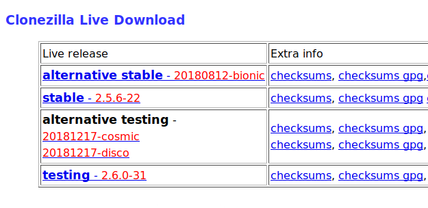
\ 

Seleccionaremos nuestra arquitectura y el tipo de fichero que queremos descargar. En nuestro caso será el tipo de fichero `iso`.

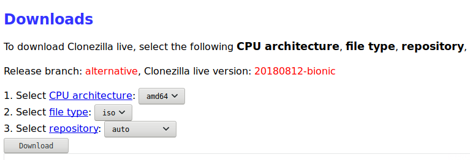
\ 

Descargaremos la imagen

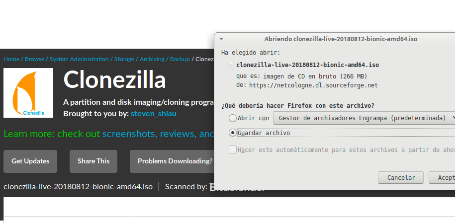
\ 

## Preparación de un disco de respaldo

Conectaremos a la máquina virtual de Xubuntu un disco duro de 10Gbs y prepararemos la máquina para ser clonada, eliminando conexiones de discos duros en el Sistema Operativo, para ello comentaremos en el fichero `fstab` las líneas que hayamos podido añadir a lo largo de las actividades anteriores, dejando de esta manera el sistema lo más estándar posible.

Además conectaremos un disco duro y le daremos formato desde la máquina Xubuntu.
 
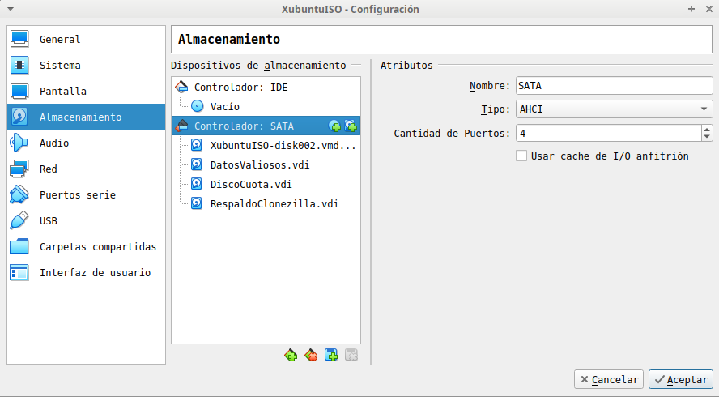
\ 

Dejaremos las conexiones como aparecen en la imagen.

Una vez arrancado el sistema vamos a formatear el disco que acabamos de conectar.

>Nota: Estos pasos podemos hacerlos con herramientas gráficas, pero es conveniente conocer y dominar este tipo de herramientas, ya que muchas veces nos encontraremos en lugares y situaciones que no tendrán herramientas gráficas para realizar las tareas.

### Creando la partición

Utilizaremos `fdisk` para esta tarea, indicándole el dispositivo (no la partición) que queremos particionar.

A continuación utilizaremos las opciones de menú a través de las `letras` para realizar las acciones.

\ 

Si pulsamos la tecla `m` obtendremos la ayuda.

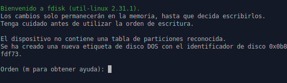
\ 

La opción que debemos escoger es la `n` (_añade una nueva partición_).

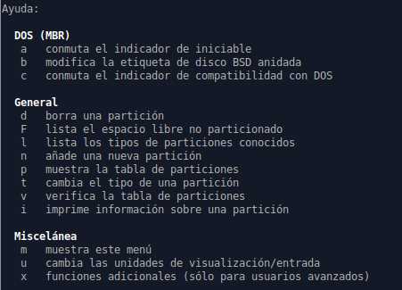
\ 

Seleccionaremos las opciones que más nos interesen.

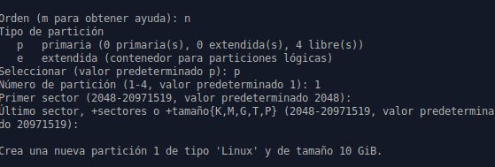
\ 

Por último escribiremos los cambios en el disco mediante la tecla `w`.

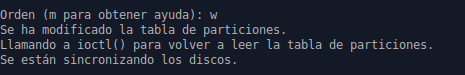
\ 

----

### Formateando la partición

Ahora formatearemos la partición creada en el paso anterior. Podríamos seleccionar cualquier tipo de ficheros que nos pudiera interesar, en este caso se ha seleccionado `ext4` como sistema de ficheros.

\ 

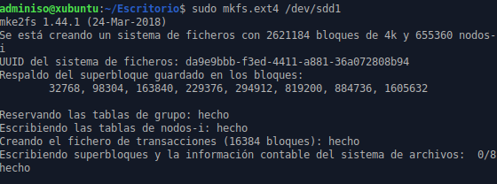
\ 

----

## Preparación del sistema

Ahora comprobaremos el `fstab` del sistema y lo preparamos para ser clonado, de tal manera que cuando lo _volquemos_ en otra máquina el sistema pueda arrancar y funcionar de manera correcta.

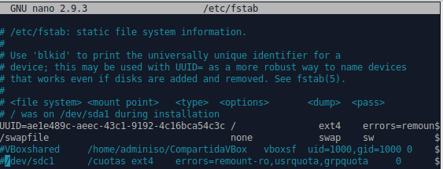
\ 

## Arranque de Clonezilla

Conectaremos la imagen de Clonezilla y seleccionaremos el arranque desde el gestor de arranque de `VirtualBox`.

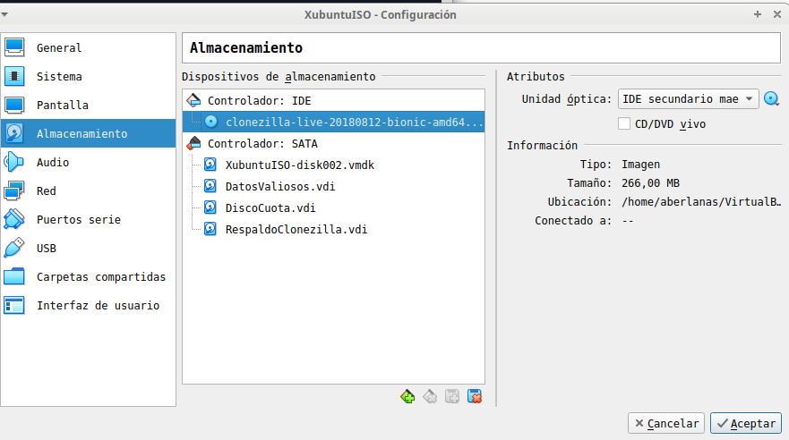
\ 

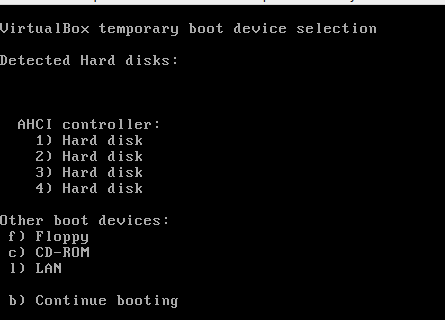
\ 

Nos aparecerá una imagen como esta, seleccionaremos la opción por defecto y seguiremos los pasos que nos permitirań copiar nuestro disco completo (`/dev/sda`) al disco que hemos formateado (`/dev/sdd1`) en el formato de Clonezilla, que no son más que una serie de ficheros que le permitirán al Clonezilla poder _restaurar_ esa copia en otro disco duro.

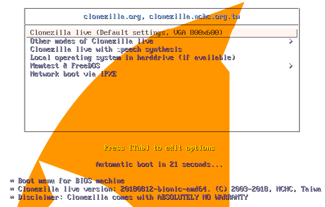
\ 

Seleccionaremos nuestra distribución de teclado e idioma

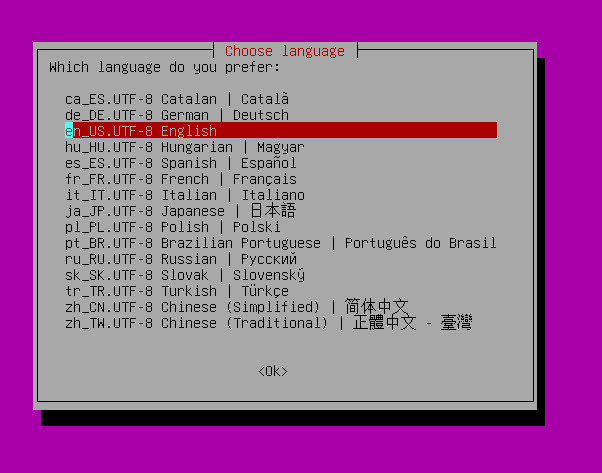
\ 

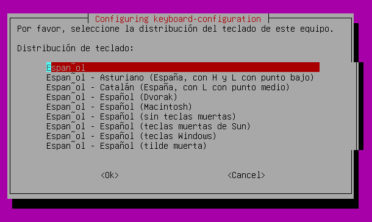
\ 

A continuación arrancaremos Clonezilla

## Modos de clonezilla

Clonezilla, al igual que todas las herramientas de clonado de discos requiere que _sepamos qué estamos haciendo_. En esta tarea estamos copiando un **disco** completo a una carpeta que se encuentra en otro disco que también es **local**. 

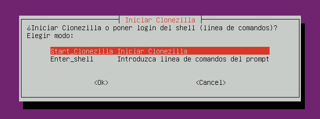
\ 

Debemos **leer atentamente** los mensajes que nos muestra el sistema de clonado, puede parecer lioso al principio, pero no hay nada que no podamos comprender si leer con atención.

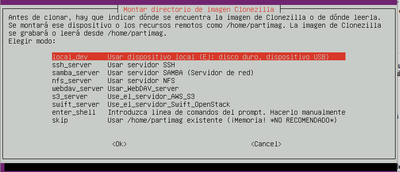
\ 

Una vez seleccionada nuestra opción para montar el **destino** de la copia, nos pide que conectemos el dispositivo o disco duro para descubrirlo _automáticamente_. Recordad que esto está pensado para hardware _real_ donde conectaríamos físicamente un disco USB para guardar en él la copia del disco.

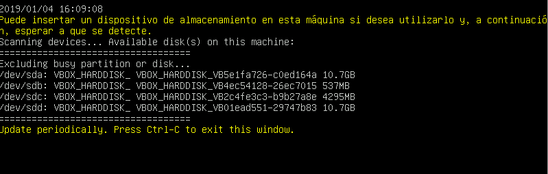
\ 

Seguir las instrucciones que nos aparecen.

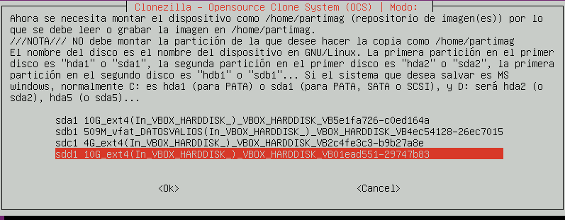
\ 

Seleccionaremos la carpeta donde almacenaremos la imagen.

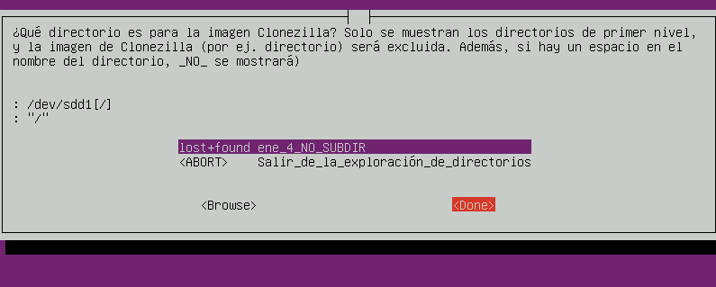
\ 

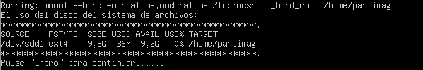
\ 

Una vez tenemos preparado el **destino** pasamos a seleccionar _qué_ queremos copiar.

A continuación nos pregunta si queremos guardar _particiones_ o _discos_. Seleccionaremos _disco_.

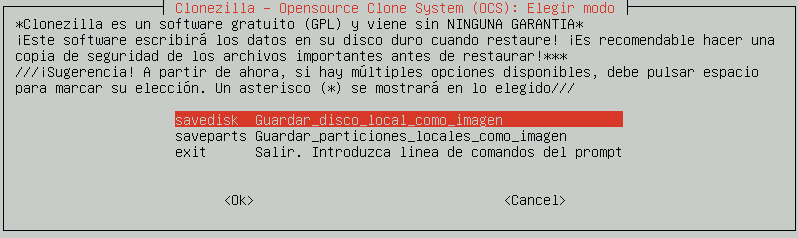
\ 

Introduciremos un nombre

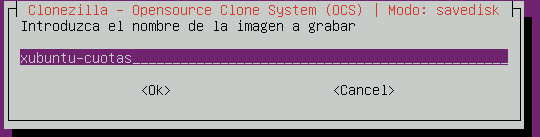
\ 

Seleccionaremos el disco

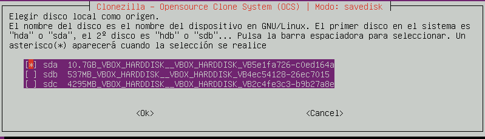
\ 

Ahora podríamos seleccionar opciones adicionales, tales como comprobación del destino y del origen, etc.

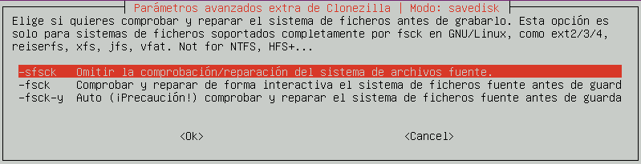
\ 

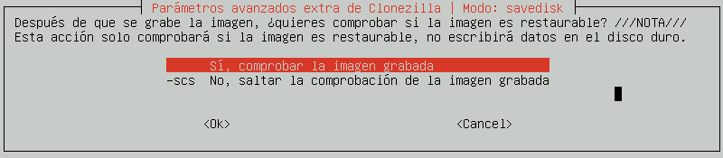
\ 

Una vez finalizada la operación deseada (guardar la imagen) nos pregunta si queremos apagar, reiniciar, o mantenernos en Clonezilla.

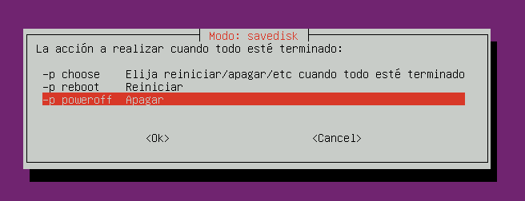
\ 

Nos muestra una línea que nos permitiría ejecutar directamente _sin pasar por el asistente_. 

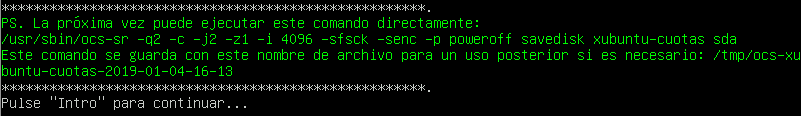
\ 

Una serie de avisos nos indicarán que vamos a realizar acciones potencialmente peligrosas. Nos aseguramos y continuamos.

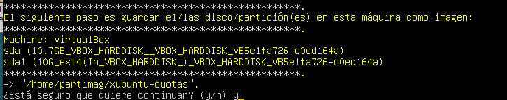
\ 

Se mostrará un progreso de la copia y el sistema se apagará (si hemos elegido esta acción), cuando finalice.

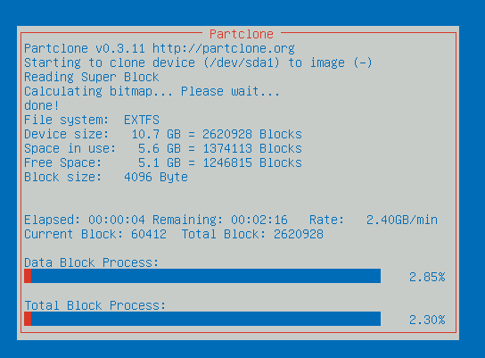
\ 

# Ejercicios

## Ejercicio 1

Realizar los pasos descritos y comprobar que en la carpeta seleccionada como destino de la copia han aparecido ficheros.

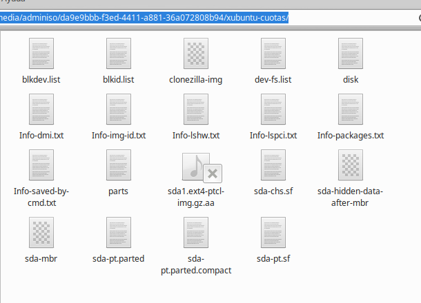
\ 

Adjuntar una captura del resultado.

## Ejercicio 2

Cread una máquina virtual nueva llamada: `xubuntu-dolly` y utilizando clonezilla: restaurar la imágen.

Cambiar el hostname, la IP y todo lo necesario para que ambas máquinas (Xubuntu y xubuntu-dolly) puedan convivir en el sistema a la vez.

Avisad al profesor para que compruebe el resultado.

## Ejercicio 3

En las máquinas virtuales podemos crear discos _exactamente iguales_, pero en el mundo real esto no ocurrirá casi nunca, busca en internet información de como podemos _redimensionar_ las imágenes creadas previamente durante el proceso de _restauración_ para que se adapten al disco duro de destino.

Prepara un documento explicando las opciones.

## Ejercicio 4

¿Qué tipo de licencias nos permitiría la instalación de SO y Aplicaciones siguiendo este sistema?

