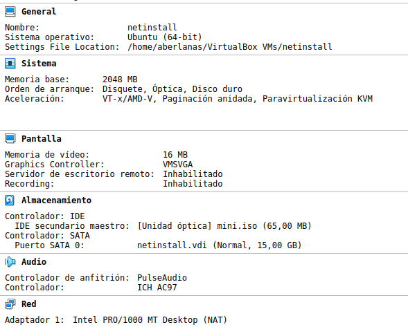
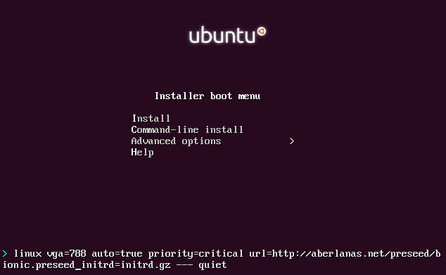

# Tarea: Netinstall

Utilizando el preseed que hemos visto en teoría, modificarlo para ajustarlo a la siguiente situación.

En la empresa PostgreSQL Soluciones están a punto de comprar 200 equipos nuevos, y necesitan un fichero de respuestas que se adapte a su infraestructura, de tal manera que teniendo tan solo imagen de instalación por red de Ubuntu (`mini.iso`) en varios USBs, puedan indicarle el fichero de respuestas y que las máquinas se instalen solas.

\ 

Los requisitos que deberemos cubrir son los siguientes:

* Nombre Completo : NombreAlumno ISO
* username : postgresql-user
* password : postgresql-pass
* Grupos a los que debe pertenecer adicionales:
  * adm
  * sudo
  * backup
  * operator

## Ejercicio 1

### Paso 1 : Modificación del preseed

Deberemos modificar las respuestas de preseed correspondientes y dejar el resto tal y como hemos visto en teoría.

Cuando este modificado, enviar este fichero al profesor por el moodle con el siguiente nombre:

nombrealumno.apellido1.preseed

El profesor habilitará entonces ese fichero en la ruta:

http://aberlanas.net/preseed/nombrealumno.apellido1.preseed

### Paso 2 : Arranque e instalación

Comprobaremos que el fichero está donde lo hemos indicado, por ejemplo utilizando un navegador web.

Si todo esta correctamente, arrancar la imagen de la netinstall de Ubuntu (`mini.iso`) que podéis descargar desde la página oficial de Ubuntu.

[Pagina de Ubuntu](https://help.ubuntu.com/community/Installation/MinimalCD)

Crearemos una máquina virtual llamda `netinstall` que tendrá las siguientes características:

\ 

Durante el arranque le indicaremos los parámetros adecuados, tal y como hemos visto en teoría:

\ 

>**NOTA**: Recordar que debéis cambiar la ruta del preseed para que se ajuste al _VUESTRO_.

Cuando la instalación haya finalizado, avisar al profesor para que compruebe el resultado.

### Paso 3 : Documentar

Documentar de manera técnica todos los cambios que habéis realizado en el `preseed`.
