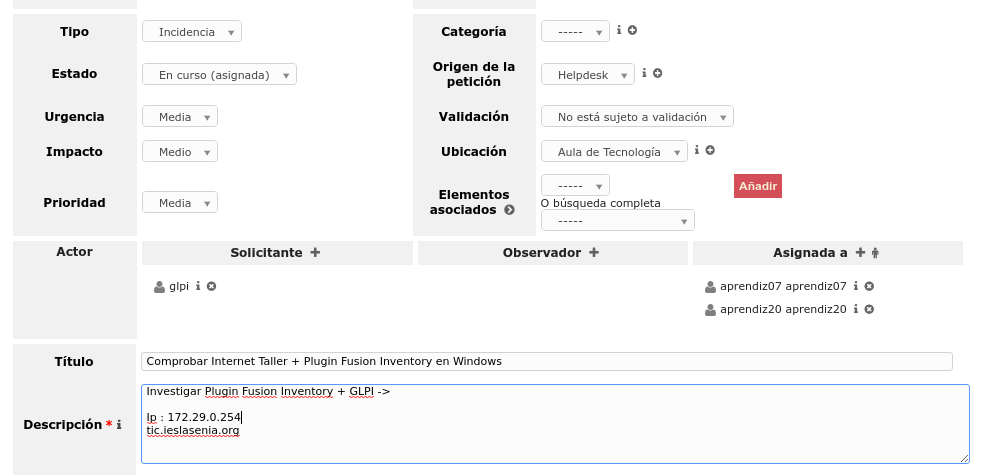

# Tarea: GLPI + Incidencias

En esta práctica entraremos en el servidor del aula, donde está instalado el Servidor de Inventario *GLPI* y comprobaremos las tareas que tengamos asignadas.

\

## Ejercicio 1

Resolver la incidencia y documentar el proceso.
