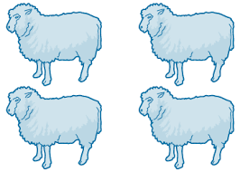

# Instalación por clonación

Hasta ahora hemos visto como instalar el sistema operativo, configurarlo, crear usuarios, grupos, instalar aplicaciones, controlar los permisos,...

Pero, ¿y si tenemos que hacer esto de manera repetida, es decir, instalar por ejemplo 10 ordenadores iguales para un equipo de personas de nuestra empresa?. Si el proceso es sencillo, seguramente seremos capaces de realizar las instalaciones de manera estandarizada y correcta, obteniendo 10 equipos iguales, de tal manera que si alguno de ellos tiene un problema podamos replicarlo y arreglarlo en los otros.

Pero puede ocurrir que el proceso de instalación sea muy complejo y la cantidad de pasos y configuraciones sea muy grande, por lo que las posibilidades de equivocarnos al repetirlas sean muy altas.  La clonación nos permite ahorrar mucho tiempo y posibles fallos, así como la _reproducibilidad_ de las instalaciones para posibles pruebas, etc.

## ¿Qué es la Clonación?

La clonación es la creación de una replica exacta de todo el contenido de un disco duro o partición de tal manera que pueda ser copiada a otro disco duro, fichero o unidad en red y puesta en marcha en un equipo diferente (o en el mismo en el caso de un respaldo).

Los datos y aplicaciones permanecen totalmente inalteradas, tal y como ocurren la clonación de seres vivos, que copiamos "bit" a "bit" el ADN del ordenador.

## Ventajas en inconvenientes

Se requiere de elemento de hardware adicionales, tales como discos duros para almacenar las imágenes, recursos para montar un servidor de imágenes de restauración, etc. Lo que conlleva una administración y una configuración.

Las ventajas son muchas, desde el ahorro de tiempo una vez tenemos la imagen creada, a la posibilidad de realizar instalaciones en minutos para probar nuevas versiones de hardware, software, etc.

Si nuestro sistema dispone de un número _limitado_ de modelos hardware, podemos tener una imagen preparada para cada uno de ellos.

## Sistemas de clonado (clonezilla)

Uno de los más famosos sistemas de clonado es DRBL, tambien conocido clonezilla.

\ 

Nos permite realizar una serie de operaciones muy importantes, restauracion de particiones, salvar datos, redimensionado de particiones, arrancar desde particiones UEFI, encriptar imagenes, etc.

### Modo Clonezilla Live

El modo clonezilla live se utiliza como los discos Live que hemos utilizado durante el curso para las instalaciones. Se conecta a un equipo y se arranca desde el clonezilla. Las opciones que aparecerán serán sobre el equipo conectado.

### Modo Clonezilla SE

También podemos configurar en nuestra red un servidor de imágenes de clonezilla, de tal manera que podamos realizar las operaciones en cada uno de los equipos de la red si arrancamos mediante PXE y cargamos el SO que este servidor nos sirve.

## Tareas a posteriori

Ya hemos comentado que se realiza una copia bit a bit de nuestra instalación almacenada, con todos los datos, configuraciones, programas, etc.

Sin embargo, hay una serie de elementos que cada ordenador debe tener de manera única:

* Nombre del equipo
* MAC Address
* IP
* Identificador SAMBA (`SID`)

Estos elementos han de _resetearse_ una vez hemos realizado el _volcado_ de la imagen en la máquina destino. Para ello en sistemas windows DRBL dispone de un software llamado _drbl-winroll_ [Pagina del proyecto](drbl-winroll.sourceforge.net). Que nos ofrece las siguientes caracterísitcas:

* Configura el `hostname`, `workgroup` y `SID` automáticamente.
* Configura la red de manera automática
* Puede añadir el equipo al dominio.
* Monitorización del cliente windows.
* Instala el `sshd` en el Host Destino (esto es _especialmente_ interesante para nosotros, lo veremos en unidades posteriores).

Todas estas operaciones han de llevarse a cabo, ya que si no tendremos problemas de máquinas duplicadas en nuestra red, lo que dará lugar a múltiples problemas difíciles de detectar.

\ 
